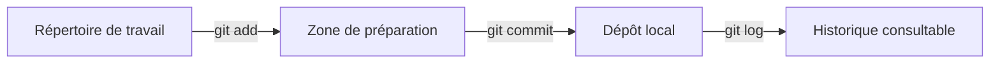

# Lab 1 — Fondamentaux de Git en local

## 1. Objectifs

À la fin de ce laboratoire, l'apprenant devra être capable de :

- créer un dépôt Git local avec `git init` ;
- distinguer le répertoire de travail, la zone de préparation et le dépôt local ;
- reconnaître un fichier non suivi, suivi, modifié ou préparé ;
- inspecter les changements avec `git status`, `git diff` et `git diff --staged` ;
- sélectionner des modifications avec `git add` ;
- enregistrer une modification logique avec `git commit` ;
- lire un historique condensé avec `git log --oneline` ;
- exclure des fichiers au moyen de `.gitignore` ;
- retirer prudemment un fichier de la zone de préparation ;
- restaurer une modification locale uniquement après l'avoir vérifiée.

Ce laboratoire reste entièrement local : aucun compte GitHub et aucun dépôt distant ne sont nécessaires.

## 2. Prérequis

- Windows et Visual Studio Code sont installés.
- Git Bash est utilisé pour toutes les commandes.
- Git est installé et accessible depuis le terminal.
- Les commandes sont exécutées une par une ; la sortie est lue avant de continuer.

Vérifier Git depuis n'importe quel dossier :

```bash
git --version
```

Cette commande ne modifie ni les fichiers ni l'historique. Elle doit afficher un numéro de version. Si Git Bash répond `command not found`, Git doit être installé ou réparé avant de poursuivre.

Vérifier aussi l'identité qui sera inscrite dans les commits :

```bash
git config --global --get user.name
git config --global --get user.email
```

Ces deux commandes lisent la configuration globale et ne modifient rien. Si une valeur est vide, la définir avec son véritable nom et l'adresse associée à GitHub :

```bash
git config --global user.name "Prénom Nom"
git config --global user.email "adresse@example.com"

note : le git fonctionne avec une hiérarchie (local -> Global -> System)
```

L'option `--global` applique l'identité aux dépôts de l'utilisateur. Elle modifie la configuration Git globale, mais ni les fichiers du projet ni son historique. Ne recopiez pas littéralement les valeurs d'exemple.

## 3. Situation de départ

Nous allons créer un petit projet fictif indépendant nommé `mini-projet-data` dans le dossier `Documents` de l'utilisateur Windows :

```text
mini-projet-data/
├── .gitignore
├── README.md
├── analyse.py
└── donnees.txt
```

Le dossier `git-collaboration-labs` contient la documentation pédagogique. Le dossier `mini-projet-data` est le dépôt d'entraînement. Il est créé séparément afin d'éviter un dépôt Git imbriqué dans un autre.

Ouvrir Git Bash, puis vérifier le dossier actuel :

```bash
pwd
```

Dans Git Bash, le dossier Windows `C:\Users\VotreNom\Documents` est généralement représenté par `/c/Users/VotreNom/Documents` et peut aussi être atteint par `~/Documents`.

Se placer dans le dossier parent prévu :

```bash
cd ~/Documents
```

Vérifier immédiatement :

```bash
pwd
ls
```

Avant de créer le dossier, vérifier qu'un dossier du même nom n'existe pas déjà :

```bash
ls -ld mini-projet-data
```

Le message `No such file or directory` signifie ici que le nom est disponible. Si le dossier existe, ne le supprimez pas : inspectez-le et choisissez avec l'assistant s'il faut le réutiliser ou employer un autre nom.

Créer ensuite le dossier, puis s'y déplacer :

```bash
mkdir mini-projet-data
cd mini-projet-data
pwd
```

Le résultat de `pwd` doit se terminer par `/Documents/mini-projet-data`.

## 4. Concepts

### 4.1 Git et GitHub

**Git** est le logiciel local qui observe des fichiers et enregistre des versions. **GitHub** est un service distant qui héberge des dépôts Git et facilite la collaboration. Dans ce laboratoire, Git fonctionne seul : aucun envoi sur Internet n'est effectué.

### 4.2 Les trois espaces principaux



- **Répertoire de travail** : fichiers visibles et modifiables dans VS Code.
- **Zone de préparation** (*staging area* ou *index*) : sélection exacte du contenu destiné au prochain commit.
- **Dépôt local** : base interne située dans le dossier caché `.git`, contenant les commits et les références.

Le trajet demandé est donc :

```text
fichier modifié
→ répertoire de travail
→ git add
→ zone de préparation
→ git commit
→ historique local
```

### 4.3 États d'un fichier

| État | Signification | Indice courant dans `git status` |
|---|---|---|
| Non suivi (*untracked*) | Git voit le fichier, mais aucune version n'a encore été enregistrée | `Untracked files` |
| Suivi et inchangé | La version de travail correspond au dernier commit | Aucun changement affiché |
| Suivi et modifié | Le fichier diffère du dernier contenu enregistré, sans être préparé | `Changes not staged for commit` |
| Préparé (*staged*) | Le contenu a été placé dans l'index pour le prochain commit | `Changes to be committed` |
| Enregistré | Le contenu préparé fait partie d'un commit local | `working tree clean` si rien d'autre n'a changé |

Un fichier peut être simultanément préparé puis modifié de nouveau. Dans ce cas, `git status` le montre dans les deux catégories : le commit prendra la version préparée, pas la modification plus récente restée dans le répertoire de travail.

### 4.4 Un commit est une unité logique

Un commit doit représenter un changement cohérent que l'on peut comprendre, relire ou annuler isolément. Par exemple :

- bon message : `Ajoute le calcul de la moyenne` ;
- message trop vague : `modifications` ;
- commit trop large : ajout d'une fonction, renommage de plusieurs fichiers et réécriture de la documentation sans lien direct.

Le message explique l'intention. Le diff montre l'implémentation.

### 4.5 Le rôle de `.gitignore`

Le fichier `.gitignore` décrit les fichiers **non suivis** que Git doit ignorer, par exemple les environnements virtuels, caches et réglages locaux d'éditeur :

```gitignore
venv/
.venv/
__pycache__/
*.pyc
.ipynb_checkpoints/
.idea/
.env
```

`.gitignore` ne retire pas automatiquement un fichier déjà suivi. Il faut donc le créer avant de préparer les fichiers indésirables. Les secrets réels ne doivent jamais être ajoutés au dépôt, même temporairement.

## 5. Commandes expliquées

Toutes les commandes Git ci-dessous, sauf indication contraire, doivent être exécutées dans `~/Documents/mini-projet-data`. Avant chaque groupe, utilisez `pwd` puis `git status` pour confirmer le contexte.

### 5.1 `git init -b main`

- **Problème résolu** : transformer un dossier ordinaire en dépôt Git.
- **Option** : `-b main` nomme `main` la branche initiale.
- **Effet** : crée le sous-dossier caché `.git`. Aucun fichier de travail n'est supprimé et aucun commit n'est créé.
- **Résultat attendu** : `Initialized empty Git repository in .../mini-projet-data/.git/`.
- **Vérification** : exécuter `git status` ; Git doit mentionner la branche `main` et l'absence de commit.
- **Erreur fréquente** : initialiser le mauvais dossier. Vérifier `pwd` avant la commande.

### 5.2 `git status`

- **Problème résolu** : connaître la branche active et l'état des fichiers.
- **Option** : aucune dans ce laboratoire.
- **Effet** : lecture seule ; ne modifie ni les fichiers, ni l'index, ni l'historique.
- **Résultat attendu** : une liste des fichiers non suivis, modifiés ou préparés.
- **Vérification** : la commande est elle-même une vérification et peut être répétée sans risque.
- **Erreur fréquente** : `fatal: not a git repository`, qui signifie que le terminal n'est pas dans un dépôt ou l'un de ses sous-dossiers.

### 5.3 `git add <fichier>`

- **Problème résolu** : choisir le contenu qui fera partie du prochain commit.
- **Argument** : `<fichier>` est le chemin précis à préparer, par exemple `analyse.py`.
- **Effet** : copie la version actuelle du fichier dans la zone de préparation. Ne crée pas de commit et ne modifie pas le fichier de travail.
- **Résultat attendu** : aucun texte si la commande réussit.
- **Vérification** : `git status`, puis `git diff --staged`.
- **Erreur fréquente** : employer `git add .` sans examiner tous les fichiers. Dans ce laboratoire, les chemins sont nommés explicitement.

### 5.4 `git diff`

- **Problème résolu** : lire les modifications suivies qui ne sont pas encore préparées.
- **Option** : aucune.
- **Effet** : lecture seule ; compare le répertoire de travail à la zone de préparation.
- **Résultat attendu** : lignes supprimées précédées de `-` et lignes ajoutées précédées de `+`.
- **Vérification** : après `git add`, la modification préparée disparaît de `git diff`.
- **Erreur fréquente** : croire qu'une sortie vide signifie qu'il n'existe aucun changement. Les changements sont peut-être déjà préparés ; vérifier `git diff --staged` et `git status`.

### 5.5 `git diff --staged`

- **Problème résolu** : relire exactement le contenu sélectionné pour le prochain commit.
- **Option** : `--staged` demande la comparaison entre la zone de préparation et le dernier commit ; avant le premier commit, la comparaison se fait avec un état vide.
- **Effet** : lecture seule.
- **Résultat attendu** : le diff des fichiers préparés.
- **Vérification** : les chemins doivent correspondre à ceux visibles sous `Changes to be committed` dans `git status`.
- **Erreur fréquente** : oublier cette relecture et enregistrer un secret ou une modification sans rapport.

### 5.6 `git commit -m "message"`

- **Problème résolu** : enregistrer dans l'historique local le contenu préparé.
- **Option** : `-m` fournit directement le message du commit.
- **Effet** : crée un nouveau commit local. Il ne publie rien sur GitHub et n'inclut pas automatiquement les modifications non préparées.
- **Résultat attendu** : identifiant abrégé du commit, message et résumé des fichiers modifiés.
- **Vérification** : `git status`, puis `git log --oneline`.
- **Erreurs fréquentes** : `nothing to commit` lorsqu'aucune modification n'est préparée ; `Author identity unknown` lorsque le nom ou l'adresse Git n'est pas configuré.

### 5.7 `git log --oneline`

- **Problème résolu** : consulter rapidement l'historique local.
- **Option** : `--oneline` affiche un commit par ligne avec son identifiant abrégé et son message.
- **Effet** : lecture seule.
- **Résultat attendu** : le commit le plus récent apparaît en premier.
- **Vérification** : le message et l'identifiant du commit précédent doivent être visibles.
- **Erreur fréquente** : `your current branch ... does not have any commits yet` avant le premier commit.

### 5.8 `git restore --staged -- <fichier>`

- **Problème résolu** : retirer un fichier de la zone de préparation sans perdre sa modification locale.
- **Options** : `--staged` cible l'index ; `--` sépare les options du chemin et évite qu'un nom ambigu soit interprété comme une option.
- **Effet** : modifie la zone de préparation, mais conserve le fichier modifié dans le répertoire de travail. Ne crée ni ne réécrit de commit.
- **Résultat attendu** : aucune sortie en cas de réussite.
- **Vérification** : `git status` doit replacer le fichier sous `Changes not staged for commit`, et `git diff` doit encore montrer sa modification.
- **Erreur fréquente** : confondre cette commande avec la restauration du fichier de travail.

### 5.9 `git restore --worktree -- <fichier>`

- **Problème résolu** : abandonner une modification non préparée devenue inutile.
- **Options** : `--worktree` cible le fichier de travail ; `--` sépare les options du chemin.
- **Effet** : remplace la modification non préparée par la version de l'index. **La modification abandonnée n'est normalement pas récupérable par Git.** Aucun commit n'est réécrit.
- **Précaution obligatoire** : exécuter d'abord `git status` et `git diff -- <fichier>`. Si le changement peut être utile, en faire une copie ou un commit avant la restauration.
- **Résultat attendu** : aucune sortie en cas de réussite.
- **Vérification** : `git diff -- <fichier>` devient vide et `git status` ne montre plus cette modification.
- **Erreur fréquente** : restaurer le mauvais fichier ou perdre un travail non commité. Ne jamais exécuter cette commande mécaniquement.

## 6. Manipulation guidée

### Étape A — Initialiser le dépôt

Dans `~/Documents/mini-projet-data`, vérifier :

```bash
pwd
git status
```

Avant l'initialisation, `git status` doit normalement répondre `fatal: not a git repository`. Ce message est attendu : le dossier n'est pas encore un dépôt.

Initialiser ensuite le dépôt :

```bash
git init -b main
```

Puis vérifier :

```bash
git status
git branch --show-current
```

La branche doit être `main` et Git doit indiquer `No commits yet`.

### Étape B — Créer les fichiers de départ

Ouvrir le dossier courant dans Visual Studio Code :

```bash
code .
```

Dans VS Code, créer les quatre fichiers suivants.

`README.md` :

```markdown
# Mini projet data

Petit projet utilisé pour apprendre Git progressivement.
```

`analyse.py` :

```python
valeurs = [12, 15, 18]
print(valeurs)
```

`donnees.txt` :

```text
12
15
18
```

`.gitignore` :

```gitignore
venv/
.venv/
__pycache__/
*.pyc
.ipynb_checkpoints/
.idea/
.env
```

Enregistrer les fichiers, revenir à Git Bash et vérifier :

```bash
pwd
git status
```

Les quatre fichiers doivent apparaître sous `Untracked files`. Ils sont visibles par Git, mais ils ne sont pas encore suivis.

### Étape C — Préparer le premier commit

Avant de sélectionner des fichiers, vérifier qu'aucun secret ou fichier inattendu n'apparaît dans `git status`. Préparer explicitement les quatre fichiers :

```bash
git add .gitignore README.md analyse.py donnees.txt
```

Vérifier la sélection :

```bash
git status
git diff --staged
```

Les quatre fichiers doivent apparaître sous `Changes to be committed` comme nouveaux fichiers. Le diff préparé doit reproduire uniquement le contenu prévu.

Créer le commit initial :

```bash
git commit -m "Initialise le mini-projet data"
```

Vérifier immédiatement :

```bash
git status
git log --oneline
```

Le répertoire de travail doit être propre et l'historique doit contenir un commit.

### Étape D — Observer le trajet d'une modification

Dans VS Code, ajouter à `analyse.py` :

```python
moyenne = sum(valeurs) / len(valeurs)
print(f"Moyenne : {moyenne}")
```

Avant toute préparation :

```bash
git status
git diff -- analyse.py
```

Le fichier doit être suivi et modifié. Le diff montre les deux lignes ajoutées.

Préparer seulement ce fichier :

```bash
git add analyse.py
```

Comparer les deux vues :

```bash
git diff
git diff --staged
```

`git diff` doit être vide pour ce changement, tandis que `git diff --staged` doit montrer les lignes préparées.

Tester sans risque la sortie de la zone de préparation :

```bash
git restore --staged -- analyse.py
git status
git diff -- analyse.py
```

Le fichier doit redevenir « modifié, non préparé », mais les deux nouvelles lignes doivent rester présentes. Le travail n'a pas été supprimé.

Préparer de nouveau le fichier et relire le contenu :

```bash
git add analyse.py
git diff --staged
```

Créer un commit logique :

```bash
git commit -m "Ajoute le calcul de la moyenne"
```

Vérifier :

```bash
git status
git log --oneline
```

### Étape E — Démontrer une restauration prudente

Ajouter temporairement cette ligne à la fin de `analyse.py`, puis enregistrer :

```python
print("ligne temporaire")
```

Inspecter exactement ce qui serait abandonné :

```bash
git status
git diff -- analyse.py
```

Uniquement si la ligne temporaire est bien la seule modification et si vous acceptez de la perdre, exécuter :

```bash
git restore --worktree -- analyse.py
```

Vérifier ensuite :

```bash
git diff -- analyse.py
git status
```

Le diff doit être vide et le fichier doit avoir retrouvé la version du dernier commit. Cette commande n'est pas utilisée pour supprimer un travail que l'on souhaite conserver.

## 7. Résultat attendu

À la fin de la manipulation guidée :

```text
mini-projet-data/
├── .git/
├── .gitignore
├── README.md
├── analyse.py
└── donnees.txt
```

Le fichier `analyse.py` doit contenir :

```python
valeurs = [12, 15, 18]
print(valeurs)
moyenne = sum(valeurs) / len(valeurs)
print(f"Moyenne : {moyenne}")
```

L'historique doit contenir deux commits, du plus récent au plus ancien :

```text
<id2> Ajoute le calcul de la moyenne
<id1> Initialise le mini-projet data
```

Les identifiants `<id1>` et `<id2>` seront remplacés par des valeurs propres à votre dépôt.

## 8. Méthode de vérification

Exécuter les commandes suivantes séparément et lire chaque résultat :

```bash
pwd
```

Le chemin doit se terminer par `/Documents/mini-projet-data`.

```bash
git branch --show-current
```

Le résultat doit être `main`.

```bash
git status
```

Le résultat attendu est :

```text
On branch main
nothing to commit, working tree clean
```

```bash
git log --oneline
```

Deux commits doivent apparaître dans l'ordre inverse de leur création.

```bash
git diff
git diff --staged
```

Les deux commandes doivent être silencieuses, car aucune modification ne reste à enregistrer.

## 9. Erreurs fréquentes

| Symptôme | Cause probable | Vérification sûre | Action conseillée |
|---|---|---|---|
| `fatal: not a git repository` | Mauvais dossier ou dépôt pas encore initialisé | `pwd` puis `ls -la` | Revenir dans `mini-projet-data` ou initialiser le bon dossier |
| `Author identity unknown` | Nom ou adresse Git absents | `git config --global --get user.name` et `git config --global --get user.email` | Configurer l'identité, puis recommencer le commit |
| `nothing to commit` | Aucun contenu préparé ou aucun changement | `git status`, `git diff`, `git diff --staged` | Préparer la modification voulue avec `git add <fichier>` |
| `git diff` est vide malgré une modification | Changement déjà préparé | `git status` et `git diff --staged` | Examiner le diff préparé |
| Un fichier indésirable apparaît comme non suivi | Règle absente de `.gitignore` | `git status` et lecture de `.gitignore` | Ajouter une règle précise avant `git add` |
| Un fichier ignoré reste suivi | Il avait déjà été ajouté ou commité | `git status` et `git log -- <fichier>` | Ne pas improviser une suppression ; transmettre les sorties pour choisir une méthode sûre |
| La mauvaise modification a été préparée | `git add` trop large ou mauvais chemin | `git status` et `git diff --staged` | `git restore --staged -- <fichier>`, puis vérifier que la modification locale demeure |

En cas d'erreur, ne lancez pas une série de commandes correctives trouvées au hasard. Transmettez la sortie exacte de :

```bash
pwd
git status
git branch --show-current
```

Dans ce laboratoire local, `git remote -v` doit normalement être vide. Sa sortie peut également être transmise si un dépôt distant semble déjà configuré.

## 10. Exercice

L'exercice commence lorsque la manipulation guidée est terminée et que `git status` indique un répertoire propre.

### Modification demandée

Ajouter à `analyse.py` le calcul du minimum et du maximum :

```python
minimum = min(valeurs)
maximum = max(valeurs)
print(f"Minimum : {minimum}")
print(f"Maximum : {maximum}")
```

### Travail à effectuer

1. Vérifier le dossier, la branche et l'état initial.
2. Modifier `analyse.py` et enregistrer le fichier.
3. Examiner la différence non préparée.
4. Préparer uniquement `analyse.py`.
5. Examiner la différence préparée.
6. Créer un commit avec un message court et précis.
7. Vérifier l'état final et l'historique.

Le message recommandé est :

```text
Ajoute les valeurs minimale et maximale
```

Ne copiez pas ici toutes les commandes de la manipulation guidée sans réfléchir : choisissez la commande correspondant à chaque transition d'état.

### Sorties à transmettre pour validation

Après l'exercice, copier dans la conversation les sorties de :

```bash
pwd
git status
git log --oneline -3
```

Puis fournir également la sortie de :

```bash
git show --stat --oneline HEAD
```

`HEAD` représente ici le commit actuellement sélectionné, normalement le dernier commit de `main`. L'option `--stat` résume les fichiers et le nombre de lignes modifiées ; `--oneline` condense l'en-tête du commit. Cette commande est en lecture seule.

## 11. Questions de compréhension

1. Quelle différence existe-t-il entre le répertoire de travail et la zone de préparation ?
2. Pourquoi `git diff` peut-il être vide alors que `git status` indique un changement préparé ?
3. Un fichier visible sous `Untracked files` appartient-il déjà à l'historique Git ?
4. Pourquoi utilise-t-on `git diff --staged` avant `git commit` ?
5. Que modifie `git add analyse.py` : le fichier, l'index ou l'historique ?
6. Pourquoi `.gitignore` n'est-il pas une solution suffisante pour un secret déjà commité ?
7. Quelle différence de risque existe-t-il entre `git restore --staged` et `git restore --worktree` ?
8. Pourquoi vaut-il mieux créer plusieurs commits logiques qu'un seul commit nommé `modifications` ?

## 12. Résumé

Dans ce laboratoire, Git a été utilisé comme système de versionnage local. `git status` décrit l'état courant, `git diff` montre les changements non préparés, `git add` sélectionne une version dans l'index, `git diff --staged` contrôle cette sélection et `git commit` l'enregistre dans l'historique. `git log --oneline` permet ensuite de retrouver les commits.

La règle essentielle est la suivante :

```text
vérifier → modifier → inspecter → préparer → relire → committer → vérifier
```

Le Lab 2 ne doit commencer qu'après l'exécution de l'exercice et la validation des sorties demandées.
