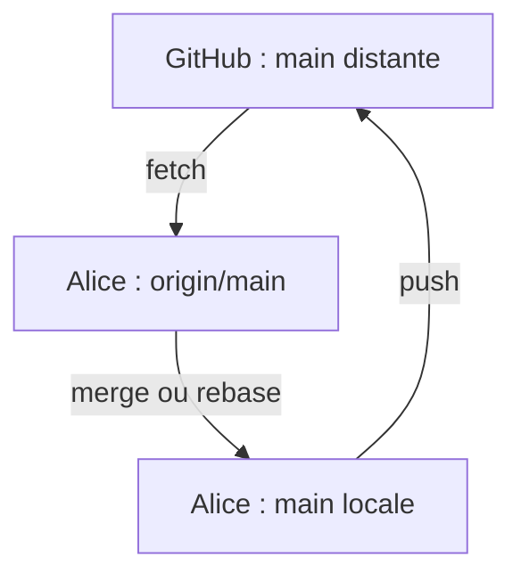

# Lab 2 — Dépôt distant et synchronisation

## 1. Objectifs

À la fin de ce laboratoire, l'apprenant devra être capable de :

- relier le dépôt local `mini-projet-data` à un dépôt GitHub ;
- expliquer le rôle du nom `origin` ;
- inspecter les dépôts distants avec `git remote -v` ;
- créer une deuxième copie de travail avec `git clone` ;
- distinguer `main`, `origin/main` et la branche `main` hébergée sur GitHub ;
- publier des commits avec `git push` ;
- récupérer les informations distantes avec `git fetch` sans modifier les fichiers de travail ;
- expliquer la différence entre `git fetch` et `git pull` ;
- diagnostiquer un rejet `fetch first` ou `non-fast-forward` ;
- intégrer proprement des commits distants avec `git pull --rebase origin main` ;
- traiter prudemment des modifications locales non enregistrées avant un pull ;
- éviter tout recours automatique à un push forcé.

Le scénario met en scène deux collaborateurs : **Alice**, qui travaille dans le dépôt créé au Lab 1, et **Bob**, qui possède une seconde copie du même dépôt.

## 2. Prérequis

- Le Lab 1 a été réalisé dans `~/Documents/mini-projet-data`.
- La branche active est `main`.
- Le dépôt contient les commits du Lab 1.
- Le répertoire de travail et la zone de préparation sont propres.
- Un compte GitHub est disponible.
- Git Bash est utilisé sous Windows.
- Une authentification GitHub fonctionnelle est nécessaire pour pousser par HTTPS.

Dans le dépôt du Lab 1, commencer par les vérifications suivantes :

```bash
cd ~/Documents/mini-projet-data
pwd
git status
git branch --show-current
git log --oneline -3
git remote -v
```

Résultat attendu :

- `pwd` se termine par `/Documents/mini-projet-data` ;
- la branche active est `main` ;
- `git status` indique `nothing to commit, working tree clean` ;
- l'historique contient les commits du Lab 1 ;
- `git remote -v` est normalement vide avant la connexion à GitHub.

Si des modifications sont présentes, si la branche n'est pas `main` ou si un remote existe déjà, ne continuez pas mécaniquement. Transmettez les sorties exactes avant d'ajouter ou de modifier un dépôt distant.

Les exemples utilisent le compte GitHub `AMYyassine`. Si le dépôt est créé sous un autre compte, remplacez ce nom dans toutes les URL sans modifier le reste des commandes.

## 3. Situation de départ

Alice possède le dépôt local créé au Lab 1 :

```text
~/Documents/mini-projet-data
```

Le laboratoire utilisera ensuite trois emplacements distincts :

```text
Alice : ~/Documents/mini-projet-data
GitHub : https://github.com/AMYyassine/mini-projet-data
Bob    : ~/Documents/mini-projet-data-bob
```

Le même utilisateur peut jouer les rôles d'Alice et de Bob sur son ordinateur. Les deux dossiers locaux doivent rester distincts. Avant une commande ou une modification dans VS Code, `pwd` permet de confirmer le rôle actif.

### Créer le dépôt GitHub vide

Sur GitHub :

1. choisir **New repository** ;
2. nommer le dépôt `mini-projet-data` ;
3. choisir la visibilité souhaitée ;
4. ne pas ajouter de `README`, de `.gitignore` ni de licence ;
5. créer le dépôt.

Le dépôt distant doit rester vide parce que le dépôt local possède déjà son propre historique. Cette précaution évite de créer immédiatement deux commits initiaux différents.

## 4. Concepts

### 4.1 Dépôt local et dépôt distant

Le dépôt local contient les commits disponibles sur l'ordinateur. Le dépôt distant GitHub constitue une autre copie du projet, accessible par le réseau. Git ne synchronise pas automatiquement ces copies : il faut exécuter explicitement `fetch`, `pull` ou `push`.

### 4.2 Le nom `origin`

`origin` est le nom court attribué par convention au dépôt distant principal. Ce n'est ni un mot réservé ni une branche. Une commande comme :

```bash
git push origin main
```

signifie : « envoyer la branche locale `main` vers le dépôt distant nommé `origin` ».

### 4.3 `main`, `origin/main` et GitHub

| Nom | Emplacement | Signification | Mise à jour habituelle |
|---|---|---|---|
| `main` | Dépôt local | Branche locale sur laquelle Alice travaille | Commit local, merge, rebase ou pull |
| `origin/main` | Dépôt local | Référence locale représentant le dernier état connu de `main` sur `origin` | `git fetch`, `git pull` ou push réussi |
| `main` sur GitHub | Dépôt distant | Branche réellement hébergée par GitHub | Push d'un collaborateur ou fusion sur GitHub |

`origin/main` n'est pas une connexion en direct avec GitHub. Si Bob pousse un commit, la copie d'Alice ne le sait pas encore. Alice doit exécuter `git fetch origin` ou `git pull` pour actualiser sa connaissance du dépôt distant.

### 4.4 Envoi, récupération et intégration



- `push` envoie des commits locaux vers GitHub ;
- `fetch` récupère des objets et actualise les références distantes locales sans intégrer les commits dans la branche active ;
- `pull` réalise d'abord un fetch, puis intègre les changements dans la branche active par merge ou par rebase selon l'option et la configuration.

### 4.5 Avance rapide et rejet `non-fast-forward`

Git accepte normalement un push lorsque la branche distante peut simplement avancer jusqu'au nouveau commit. C'est une **avance rapide** (*fast-forward*).

Si GitHub possède un commit absent de la branche locale, avancer la branche distante jusqu'au commit local ferait disparaître ce travail de l'historique visible. Git refuse donc le push. Le refus protège les commits distants ; il ne signifie pas que Git est cassé.

### 4.6 Divergence et conflit textuel

Un historique diverge lorsque deux branches contiennent chacune au moins un commit absent de l'autre. Cela ne provoque pas nécessairement un conflit textuel. Si Alice et Bob ont modifié des fichiers ou des zones compatibles, Git peut intégrer automatiquement leurs commits. Le conflit textuel sera étudié au Lab 3.

## 5. Commandes expliquées

### 5.1 `git remote -v`

- **Problème résolu** : connaître les dépôts distants et leurs URL.
- **Dossier** : à exécuter dans n'importe quel dossier du dépôt concerné.
- **Option** : `-v` signifie *verbose* et affiche les URL utilisées pour récupérer et envoyer.
- **Effet** : lecture seule ; aucun fichier, commit ou remote n'est modifié.
- **Résultat attendu** : deux lignes par remote, marquées `(fetch)` et `(push)`.
- **Vérification** : contrôler le nom `origin` et l'URL complète.
- **Erreur fréquente** : exécuter la commande dans le mauvais clone et croire que les deux dossiers partagent automatiquement la même configuration.

### 5.2 `git remote add origin <URL>`

- **Problème résolu** : associer le dépôt local existant à GitHub.
- **Dossier** : dépôt d'Alice, `~/Documents/mini-projet-data`.
- **Arguments** : `origin` est le nom local choisi ; `<URL>` est l'adresse exacte du dépôt GitHub.
- **Effet** : modifie la configuration locale du dépôt. Aucun fichier et aucun commit ne sont envoyés.
- **Résultat attendu** : aucune sortie en cas de réussite.
- **Vérification** : `git remote -v`.
- **Erreur fréquente** : `remote origin already exists`. Dans ce cas, ne remplacez pas l'URL sans inspection ; transmettez `git remote -v`.

### 5.3 `git clone <URL> <dossier>`

- **Problème résolu** : créer une nouvelle copie locale complète d'un dépôt distant.
- **Dossier** : dossier parent, ici `~/Documents`, et non le dépôt d'Alice.
- **Arguments** : `<URL>` identifie le dépôt ; `<dossier>` choisit le nom de la nouvelle copie.
- **Effet** : crée le dossier, télécharge l'historique, crée une branche locale et configure automatiquement `origin`.
- **Résultat attendu** : progression se terminant par la copie des fichiers.
- **Vérification** : entrer dans le nouveau dossier, puis exécuter `git status`, `git remote -v` et `git log --oneline`.
- **Erreur fréquente** : cloner dans un dossier déjà existant et non vide.

### 5.4 `git push -u origin main`

- **Problème résolu** : publier la branche locale `main` et établir son suivi distant.
- **Dossier** : dépôt d'Alice lors du premier envoi.
- **Option** : `-u`, forme courte de `--set-upstream`, associe la branche locale `main` à `origin/main` pour permettre ensuite l'usage de `git push` sans arguments.
- **Effet** : envoie les commits et peut faire avancer la branche distante. Ne modifie pas les fichiers de travail.
- **Résultat attendu** : création de la branche distante et message indiquant que `main` suit `origin/main`.
- **Vérification** : `git status`, `git branch -vv` et consultation du dépôt GitHub.
- **Erreurs fréquentes** : mauvaise URL, authentification refusée ou dépôt distant contenant déjà un historique incompatible.

### 5.5 `git push`

- **Problème résolu** : publier les nouveaux commits sur la branche distante suivie.
- **Dossier** : clone contenant les commits à publier.
- **Option** : aucune ; la branche de suivi doit déjà être configurée.
- **Effet** : met à jour GitHub seulement si l'opération est acceptée. Un push rejeté ne supprime ni les commits locaux ni les fichiers.
- **Résultat attendu** : plage de commits envoyée, par exemple `abc1234..def5678  main -> main`.
- **Vérification** : `git status`, `git log --decorate --oneline -3` et GitHub.
- **Erreur fréquente** : répondre à un rejet par `git push --force`. Cette solution n'est pas proposée sur `main`.

### 5.6 `git fetch origin`

- **Problème résolu** : actualiser la connaissance locale du dépôt `origin` avant de décider comment intégrer ses changements.
- **Dossier** : clone à actualiser, ici celui d'Alice.
- **Argument** : `origin` désigne le remote interrogé.
- **Effet** : télécharge les commits et actualise notamment `origin/main`. La branche locale `main` et les fichiers de travail ne sont pas modifiés.
- **Résultat attendu** : mention de la branche distante mise à jour, ou aucune sortie si rien n'a changé.
- **Vérification** : `git log --oneline --graph --decorate --all` et `git status`.
- **Erreur fréquente** : penser que les fichiers de Bob apparaîtront immédiatement dans le répertoire de travail après le fetch.

### 5.7 `git pull`

- **Problème résolu** : récupérer puis intégrer des changements distants dans la branche active.
- **Dossier** : clone à synchroniser.
- **Effet** : équivaut conceptuellement à un `fetch` suivi d'une intégration. Cette intégration peut être un merge ou un rebase selon les options et la configuration.
- **Risque** : contrairement à `fetch`, `pull` peut modifier la branche locale et les fichiers de travail.
- **Vérification préalable** : `pwd`, `git status`, `git branch --show-current` et `git remote -v`.
- **Erreur fréquente** : exécuter `pull` sans savoir quelle branche et quel remote sont concernés.

### 5.8 `git pull --rebase origin main`

- **Problème résolu** : intégrer `origin/main` tout en replaçant les commits locaux au-dessus des commits distants.
- **Dossier** : dépôt d'Alice, sur sa branche locale `main`.
- **Option et arguments** : `--rebase` choisit le rebase au lieu d'un commit de fusion ; `origin` est le remote ; `main` est la branche distante demandée.
- **Effet** : récupère les commits distants, avance la base locale, puis recrée les commits propres à Alice au-dessus. Les identifiants de ces commits locaux changent.
- **Résultat attendu** : message semblable à `Successfully rebased and updated refs/heads/main`.
- **Vérification** : `git status` et `git log --oneline --graph --decorate --all`.
- **Erreurs fréquentes** : modifications locales non enregistrées, conflit pendant le rebase ou mauvaise branche active.

## 6. Manipulation guidée

### Étape A — Relier le dépôt d'Alice à GitHub

Dans le dépôt d'Alice :

```bash
cd ~/Documents/mini-projet-data
pwd
git status
git branch --show-current
git remote -v
```

Ne continuez que si le chemin est correct, la branche est `main`, le répertoire est propre et aucun remote inattendu n'apparaît.

Ajouter le dépôt GitHub vide :

```bash
git remote add origin https://github.com/AMYyassine/mini-projet-data.git
```

Vérifier avant tout envoi :

```bash
git remote -v
```

Les URL de récupération et d'envoi doivent être exactement celles du nouveau dépôt.

Publier la branche initiale :

```bash
git push -u origin main
```

Vérifier :

```bash
git status
git branch -vv
```

La ligne de `main` doit mentionner `[origin/main]` et Git doit indiquer que la branche est à jour.

### Étape B — Créer la copie de Bob

Quitter le dépôt d'Alice et vérifier le dossier parent :

```bash
cd ~/Documents
pwd
ls -ld mini-projet-data-bob
```

Si `mini-projet-data-bob` existe déjà, ne le supprimez pas. Inspectez-le ou choisissez un autre nom avec l'assistant.

Cloner le dépôt :

```bash
git clone https://github.com/AMYyassine/mini-projet-data.git mini-projet-data-bob
```

Entrer dans la copie de Bob et vérifier :

```bash
cd mini-projet-data-bob
pwd
git status
git branch --show-current
git remote -v
git log --oneline -3
```

Le chemin doit se terminer par `/mini-projet-data-bob`, la branche doit être `main` et l'historique doit correspondre à celui publié par Alice.

### Étape C — Alice crée un commit local sans le pousser

Revenir dans la copie d'Alice :

```bash
cd ~/Documents/mini-projet-data
pwd
git status
git branch --show-current
```

Dans `analyse.py`, ajouter :

```python
etendue = maximum - minimum
print(f"Étendue : {etendue}")
```

Examiner, préparer et enregistrer uniquement cette modification :

```bash
git diff -- analyse.py
git add analyse.py
git diff --staged
git commit -m "Ajoute le calcul de l'étendue"
```

Vérifier :

```bash
git status
git log --oneline -3
```

Alice possède maintenant un commit local que GitHub ne possède pas. Ne lancez pas encore `git push`.

### Étape D — Bob crée et pousse un autre commit

Revenir dans la copie de Bob :

```bash
cd ~/Documents/mini-projet-data-bob
pwd
git status
git branch --show-current
```

Dans `README.md`, ajouter :

```markdown
## Exécution

Lancer le programme avec `python analyse.py`.
```

Examiner et enregistrer la modification :

```bash
git diff -- README.md
git add README.md
git diff --staged
git commit -m "Documente l'exécution du script"
```

Avant l'envoi :

```bash
git status
git remote -v
```

Publier le commit de Bob :

```bash
git push
```

Vérifier :

```bash
git status
git log --oneline --decorate -3
```

GitHub contient maintenant le commit de Bob. La copie d'Alice ne le connaît pas encore.

### Étape E — Produire volontairement un push refusé

Revenir dans la copie d'Alice :

```bash
cd ~/Documents/mini-projet-data
pwd
git status
git branch --show-current
git remote -v
```

Tenter l'envoi :

```bash
git push
```

Le push doit être refusé avec un message semblable à :

```text
! [rejected]        main -> main (fetch first)
error: failed to push some refs to 'https://github.com/AMYyassine/mini-projet-data.git'
hint: Updates were rejected because the remote contains work that you do not have locally.
```

Ce résultat est volontaire. GitHub possède le commit de Bob, tandis qu'Alice possède son propre commit. Forcer le push pourrait écraser le travail distant visible ; il ne faut pas le faire.

### Étape F — Inspecter la divergence

Commencer par l'état local :

```bash
git status
```

Avant le fetch, la copie d'Alice peut encore croire qu'elle est seulement en avance, car son `origin/main` local n'a pas été actualisé.

Récupérer les informations distantes sans intégrer les fichiers :

```bash
git fetch origin
```

Inspecter ensuite :

```bash
git status
git log --oneline --graph --decorate --all
```

Le graphe doit montrer deux commits séparés reposant sur un ancêtre commun, par exemple :

```text
* <alice> (HEAD -> main) Ajoute le calcul de l'étendue
| * <bob> (origin/main) Documente l'exécution du script
|/
* <base> Ajoute les valeurs minimale et maximale
```

Le contenu exact et les identifiants varient. Le point essentiel est que `main` et `origin/main` désignent maintenant deux extrémités différentes. Les fichiers de travail d'Alice n'ont pas été remplacés par le fetch.

### Étape G — Intégrer par rebase puis pousser

Avant l'intégration, vérifier une dernière fois :

```bash
pwd
git status
git branch --show-current
```

Le répertoire doit être propre et la branche active doit être `main`.

Intégrer le travail de Bob :

```bash
git pull --rebase origin main
```

Cette commande :

1. récupère l'état actuel de `origin/main` ;
2. identifie le commit local propre à Alice ;
3. place la branche locale sur le commit de Bob ;
4. rejoue le changement d'Alice au-dessus ;
5. crée donc un nouvel identifiant pour le commit rejoué d'Alice.

Comme Alice et Bob ont modifié des fichiers différents, aucun conflit textuel ne devrait apparaître.

Vérifier le nouvel historique :

```bash
git status
git log --oneline --graph --decorate --all
```

Le graphe doit maintenant être linéaire : le commit rejoué d'Alice se trouve au-dessus du commit de Bob. La branche locale est en avance sur `origin/main`.

Publier le résultat :

```bash
git push
```

Vérifier l'état final :

```bash
git status
git log --oneline --graph --decorate --all -6
```

### Étape H — Comprendre un pull refusé à cause de changements locaux

`git pull --rebase` peut refuser de démarrer lorsque des modifications locales ne sont pas enregistrées. Le message peut ressembler à :

```text
error: cannot pull with rebase: You have unstaged changes.
error: please commit or stash them.
```

Commencer toujours par :

```bash
pwd
git status
git diff
git diff --staged
```

Trois décisions sont possibles.

#### Possibilité 1 — Le travail est terminé : créer un commit

```bash
git add <fichier-précis>
git diff --staged
git commit -m "Message décrivant le changement"
git status
git pull --rebase origin main
```

Cette solution inscrit le travail dans l'historique avant la synchronisation. Elle convient seulement si le changement constitue déjà une unité logique.

#### Possibilité 2 — Le travail est incomplet : utiliser temporairement `stash`

```bash
git stash push -u -m "Travail temporaire avant synchronisation"
git status
git pull --rebase origin main
git stash list
git stash pop
git status
```

- `stash` met temporairement de côté les modifications ;
- `push` crée l'entrée de stash ;
- `-u` inclut aussi les fichiers non suivis, mais pas les fichiers ignorés ;
- `-m` associe une description lisible ;
- `pop` réapplique le travail et supprime l'entrée seulement si l'application réussit complètement.

`git stash pop` peut lui-même produire un conflit. Il faut donc lire `git status` après son exécution.

#### Possibilité 3 — Le travail est inutile : restaurer uniquement la modification rejetée

Pour un fichier suivi et non préparé :

```bash
git diff -- <fichier-précis>
git restore --worktree -- <fichier-précis>
git status
```

La restauration supprime la modification non enregistrée du fichier ciblé. Elle ne doit être exécutée qu'après inspection et seulement si la perte est volontaire. Un fichier non suivi inutile peut être supprimé manuellement dans VS Code après vérification ; `git clean -fd` n'est pas proposé.

## 7. Résultat attendu

À la fin du scénario :

- GitHub contient les commits d'Alice et de Bob ;
- `main` et `origin/main` désignent le même dernier commit dans la copie d'Alice ;
- l'historique d'Alice est linéaire après le rebase ;
- le répertoire de travail d'Alice est propre ;
- la copie de Bob est devenue en retard d'un commit après le push final d'Alice, jusqu'à sa prochaine récupération.

Historique simplifié attendu chez Alice :

```text
* <alice-rejoué> (HEAD -> main, origin/main) Ajoute le calcul de l'étendue
* <bob> Documente l'exécution du script
* <lab1> Ajoute les valeurs minimale et maximale
* <lab1> Ajoute le calcul de la moyenne
* <initial> Initialise le mini-projet data
```

L'identifiant initial du commit d'Alice n'existe plus sur `main`, car le rebase l'a recréé au-dessus du commit de Bob. Son contenu et son message restent cependant présents.

## 8. Méthode de vérification

Dans la copie d'Alice, exécuter séparément :

```bash
pwd
```

Le chemin doit se terminer par `/Documents/mini-projet-data`.

```bash
git status
```

Le résultat attendu est :

```text
On branch main
Your branch is up to date with 'origin/main'.
nothing to commit, working tree clean
```

```bash
git branch -vv
```

La branche `main` doit suivre `origin/main` et les deux références doivent être synchronisées.

```bash
git remote -v
```

Les deux URL doivent pointer vers `AMYyassine/mini-projet-data.git`.

```bash
git log --oneline --graph --decorate --all -6
```

Les commits de Bob puis d'Alice doivent apparaître dans un historique linéaire, avec `HEAD -> main` et `origin/main` sur le dernier commit.

Dans la copie de Bob, `git status` peut indiquer que `main` est en retard après le dernier push d'Alice. Ce résultat est normal : chaque clone possède ses propres références locales.

## 9. Erreurs fréquentes

| Symptôme | Cause probable | Inspection sûre | Action conseillée |
|---|---|---|---|
| `remote origin already exists` | Un remote nommé `origin` est déjà configuré | `git remote -v` | Vérifier l'URL avant toute modification |
| `Repository not found` | URL incorrecte, dépôt privé inaccessible ou authentification insuffisante | `git remote -v` et page GitHub | Corriger l'accès ou l'URL après vérification |
| `src refspec main does not match any` | Branche `main` absente ou aucun commit local | `git branch --show-current` et `git log --oneline` | Revenir au bon dépôt ou terminer le premier commit |
| `fetch first` / `non-fast-forward` | GitHub possède des commits absents localement | `git fetch origin`, puis graphe de l'historique | Intégrer les commits avant de pousser |
| `cannot pull with rebase: You have unstaged changes` | Travail local non enregistré | `git status`, `git diff`, `git diff --staged` | Commit, stash ou restauration volontaire du seul travail inutile |
| `not possible to fast-forward` | L'historique a divergé et la stratégie exige une avance rapide | `git log --oneline --graph --decorate --all` | Choisir consciemment merge ou rebase ; dans ce lab, rebase |
| Invite d'authentification ou échec HTTP | GitHub exige une connexion valide | Lire le message exact | Utiliser le flux d'authentification GitHub ; ne pas communiquer de jeton dans la conversation |
| Modification faite dans le mauvais clone | Alice et Bob utilisent des dossiers semblables | `pwd`, `git status`, `git remote -v` | Revenir dans le dossier correspondant au rôle souhaité |

En cas d'erreur, transmettre sans correction improvisée :

```bash
pwd
git status
git branch --show-current
git remote -v
git log --oneline --graph --decorate --all -8
```

Joindre également le message d'erreur complet. Ne jamais transmettre de mot de passe, de jeton d'accès ou de clé privée.

## 10. Exercice

Cet exercice doit produire une deuxième divergence sans conflit textuel.

### État initial requis

Dans les deux copies, actualiser d'abord la compréhension de l'état. Ne lancez pas encore de commande d'intégration :

```bash
pwd
git status
git branch --show-current
git remote -v
git fetch origin
git log --oneline --graph --decorate --all -6
```

Si Bob est en retard, intégrer d'abord `origin/main` dans sa branche propre uniquement après avoir confirmé que son répertoire est propre.

### Travail demandé

1. Dans la copie d'Alice, ajouter à `README.md` une section `## Données` indiquant que `donnees.txt` contient un nombre par ligne.
2. Examiner le diff, préparer uniquement `README.md` et créer le commit `Documente le format des données` sans le pousser.
3. Dans la copie de Bob, s'assurer que sa branche part du dernier état distant, puis ajouter la valeur `21` à `donnees.txt`.
4. Examiner le diff, préparer uniquement `donnees.txt`, créer le commit `Ajoute une observation aux données`, puis le pousser.
5. Dans la copie d'Alice, tenter `git push` et conserver le message de rejet.
6. Exécuter la procédure d'inspection : `git status`, `git fetch origin`, puis le graphe complet.
7. Expliquer avec vos mots pourquoi `main` et `origin/main` divergent.
8. Intégrer le commit de Bob avec `git pull --rebase origin main`.
9. Vérifier l'historique, puis pousser le commit rejoué d'Alice.
10. Vérifier que `main`, `origin/main` et GitHub présentent le même dernier commit.

### Sorties à transmettre pour validation

Copier le message complet du push refusé, puis les sorties finales obtenues chez Alice :

```bash
pwd
git status
git branch -vv
git remote -v
git log --oneline --graph --decorate --all -8
```

Répondre également aux questions 3, 5 et 7 de la section suivante.

## 11. Questions de compréhension

1. Pourquoi `origin` n'est-il pas une branche ?
2. Quelle différence existe-t-il entre `main` et `origin/main` dans le clone d'Alice ?
3. Pourquoi `git fetch origin` ne modifie-t-il pas les fichiers visibles dans le répertoire de travail ?
4. Pourquoi le premier `git push` d'Alice est-il refusé après le push de Bob ?
5. Quelle différence essentielle existe-t-il entre `git fetch` et `git pull` ?
6. Pourquoi le commit local d'Alice reçoit-il un nouvel identifiant après le rebase ?
7. Pourquoi deux historiques divergents ne produisent-ils pas nécessairement un conflit textuel ?
8. Dans quel cas choisiriez-vous un commit plutôt qu'un stash avant un pull ?
9. Quel risque présente la restauration d'une modification non enregistrée ?
10. Pourquoi ne faut-il pas utiliser automatiquement un push forcé sur `main` ?

## 12. Résumé

Un dépôt distant est une copie distincte du dépôt local. `origin` est son nom court conventionnel. La branche locale `main` contient le travail courant, tandis que `origin/main` représente le dernier état distant connu localement.

Les quatre opérations centrales de ce laboratoire sont :

| Commande | Transfert réseau | Modifie la branche active | Rôle |
|---|---:|---:|---|
| `git remote -v` | Non | Non | Inspecter les remotes |
| `git fetch origin` | Oui | Non | Actualiser les références distantes locales |
| `git pull --rebase origin main` | Oui | Oui | Récupérer puis rejouer les commits locaux au-dessus du distant |
| `git push` | Oui | Non pour les fichiers locaux | Publier des commits si GitHub peut avancer sans perdre d'historique |

Face à un push refusé, la procédure essentielle est :

```text
vérifier → fetch → visualiser la divergence → intégrer → vérifier → pousser
```

Le rejet protège l'historique distant. Il faut le comprendre et intégrer les changements, jamais le contourner automatiquement par un push forcé.
