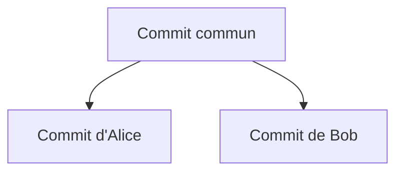

# Lab 3 — Branches, fusions et conflits

## 1. Objectifs

À la fin de ce laboratoire, l'apprenant devra être capable de :

- expliquer qu'une branche est un pointeur mobile vers un commit ;
- identifier la branche active avec `git branch` et `git branch --show-current` ;
- changer de branche avec `git switch` ;
- créer une branche et s'y déplacer avec `git switch -c` ;
- fusionner une branche avec `git merge` ;
- distinguer une avance rapide, une fusion automatique et un conflit textuel ;
- expliquer la différence entre branches distinctes, historique divergent et conflit ;
- produire puis résoudre manuellement un conflit reproductible ;
- interpréter `HEAD` et les marqueurs de conflit ;
- vérifier une résolution avant de créer le commit de fusion ;
- supprimer avec `git branch -d` une branche déjà fusionnée ;
- interrompre prudemment une fusion avec `git merge --abort` lorsque sa résolution doit être reportée.

Le scénario utilise `config.txt` et deux branches représentant Alice et Bob. Toutes les manipulations sont effectuées dans la copie principale `~/Documents/mini-projet-data`.

## 2. Prérequis

- Les Labs 1 et 2 ont été exécutés.
- `mini-projet-data` est relié au remote `origin`.
- La branche locale `main` suit `origin/main`.
- Le répertoire de travail et la zone de préparation sont propres.
- Git Bash est utilisé sous Windows.

Avant de créer une branche, vérifier l'état exact :

```bash
cd ~/Documents/mini-projet-data
pwd
git status
git branch --show-current
git remote -v
git fetch origin
git status
git log --oneline --graph --decorate --all -8
```

Résultat requis :

- `pwd` se termine par `/Documents/mini-projet-data` ;
- la branche active est `main` ;
- `git status` indique un répertoire propre ;
- `origin` pointe vers le bon dépôt GitHub ;
- `main` et `origin/main` ne divergent pas.

Si `main` est en retard, en avance ou divergente, ne commencez pas le scénario. Transmettez les sorties exactes pour synchroniser le dépôt sans perdre de travail.

Vérifier aussi que les branches du scénario n'existent pas déjà :

```bash
git branch --list feature-description feature-alice feature-bob
```

Une sortie vide est attendue. Si un nom apparaît, ne supprimez pas la branche automatiquement : elle peut contenir du travail d'une tentative précédente.

## 3. Situation de départ

Le dépôt possède une branche stable `main`. Le scénario comprend deux parties :

1. une divergence sans conflit, parce que deux branches modifient des fichiers différents ;
2. une divergence avec conflit, parce qu'Alice et Bob modifient la même ligne de `config.txt`.

Le fichier `config.txt` contiendra initialement :

```text
learning_rate=0.10
```

Alice remplacera cette valeur par :

```text
learning_rate=0.05
```

Bob la remplacera indépendamment par :

```text
learning_rate=0.20
```

Les deux changements seront enregistrés dans des commits différents, créés depuis le même commit de base. Git ne pourra donc pas choisir seul la valeur correcte lors de la fusion.

## 4. Concepts

### 4.1 Branche

Une branche est un nom qui pointe vers un commit. Lorsqu'un nouveau commit est créé sur la branche active, ce pointeur avance. La branche ne constitue pas une copie complète du dossier : Git reconstruit les fichiers correspondant au commit sélectionné.

### 4.2 `HEAD`

`HEAD` représente la position actuellement sélectionnée. Dans l'usage normal, il pointe vers la branche active. Si l'on exécute `git merge feature-bob` depuis `feature-alice`, `HEAD` désigne donc le côté `feature-alice` de la fusion.

### 4.3 Historique divergent

Deux branches divergent lorsqu'elles possèdent des commits différents après un ancêtre commun :



La divergence décrit la forme de l'historique. Elle ne signifie pas encore qu'un conflit textuel existe.

### 4.4 Fusion sans conflit

Git peut fusionner automatiquement des branches divergentes lorsque leurs modifications sont compatibles, par exemple si Alice modifie `README.md` et Bob modifie `donnees.txt`. Un commit de fusion peut alors réunir les deux lignées.

Si la branche courante n'a aucun commit propre depuis la création de l'autre branche, Git peut simplement avancer son pointeur : c'est une fusion **fast-forward**.

### 4.5 Conflit textuel

Un conflit apparaît lorsque Git rencontre des modifications incompatibles qu'il ne peut pas arbitrer automatiquement. Modifier différemment la même ligne est le cas classique.

Un conflit n'est ni une perte de données ni une panne de Git. Git conserve les deux versions, marque la zone ambiguë et demande une décision humaine.

### 4.6 Les marqueurs de conflit

Dans le scénario, `config.txt` prendra temporairement cette forme :

```text
<<<<<<< HEAD
learning_rate=0.05
=======
learning_rate=0.20
>>>>>>> feature-bob
```

- `<<<<<<< HEAD` commence la version de la branche active, ici `feature-alice` ;
- `=======` sépare les deux propositions ;
- `>>>>>>> feature-bob` termine la version apportée par la branche fusionnée ;
- les marqueurs eux-mêmes ne font pas partie de la configuration finale et doivent disparaître ;
- les collaborateurs doivent décider de conserver une valeur, l'autre, ou une troisième valeur validée ensemble.

### 4.7 Trois notions à ne pas confondre

| Notion | Définition | Conflit obligatoire ? |
|---|---|---:|
| Branches différentes | Deux noms pointent vers des commits qui peuvent être identiques ou distincts | Non |
| Historique divergent | Chaque branche possède au moins un commit absent de l'autre | Non |
| Conflit textuel | Git ne peut pas combiner automatiquement des modifications | Oui, résolution humaine nécessaire |

## 5. Commandes expliquées

Toutes les commandes de cette section sont exécutées dans `~/Documents/mini-projet-data`. Avant une opération de branche ou de fusion, vérifier `pwd`, `git status` et `git branch --show-current`.

### 5.1 `git branch`

- **Problème résolu** : lister les branches locales.
- **Effet** : lecture seule sans option de création ou de suppression.
- **Résultat attendu** : la branche active est précédée de `*`.
- **Vérification** : comparer avec `git branch --show-current`.
- **Erreur fréquente** : croire que la commande sans argument change de branche.

### 5.2 `git branch --show-current`

- **Problème résolu** : afficher uniquement le nom de la branche active.
- **Option** : `--show-current` demande le nom courant sans la liste complète.
- **Effet** : lecture seule.
- **Résultat attendu** : par exemple `main` ou `feature-alice`.
- **Erreur fréquente** : ignorer cette vérification avant un commit et enregistrer le travail sur la mauvaise branche.

### 5.3 `git switch <branche>`

- **Problème résolu** : sélectionner une branche locale existante.
- **Argument** : `<branche>` est son nom exact.
- **Effet** : déplace `HEAD` et met à jour les fichiers de travail pour représenter la branche choisie. Aucun commit n'est créé.
- **Résultat attendu** : `Switched to branch '<branche>'`.
- **Vérification** : `git branch --show-current` et `git status`.
- **Erreur fréquente** : changements locaux incompatibles empêchant le changement de branche. Il faut d'abord décider de les committer, les stasher ou les restaurer volontairement.

### 5.4 `git switch -c <nouvelle-branche>`

- **Problème résolu** : créer une branche à partir du commit courant et s'y déplacer immédiatement.
- **Option** : `-c` signifie *create*.
- **Effet** : crée un pointeur de branche et déplace `HEAD`. Aucun fichier n'est dupliqué et aucun commit n'est créé.
- **Résultat attendu** : `Switched to a new branch '<nouvelle-branche>'`.
- **Vérification** : `git branch` et `git branch --show-current`.
- **Erreurs fréquentes** : créer la branche depuis le mauvais commit ou employer un nom déjà existant.

### 5.5 `git merge <branche>`

- **Problème résolu** : intégrer l'historique de `<branche>` dans la branche actuellement active.
- **Point essentiel** : la direction dépend de la branche courante. Pour intégrer `feature-bob` dans `feature-alice`, il faut être sur `feature-alice`.
- **Effet** : peut déplacer la branche par fast-forward, créer un commit de fusion ou ouvrir un conflit. Les fichiers peuvent être modifiés.
- **Résultat attendu** : `Fast-forward`, fusion automatique avec résumé, ou message `CONFLICT`.
- **Vérification** : `git status` et `git log --oneline --graph --decorate --all`.
- **Erreur fréquente** : inverser la branche courante et la branche argument.

### 5.6 `git merge --abort`

- **Problème résolu** : abandonner une fusion en cours lorsque la résolution doit être reportée.
- **Option** : `--abort` demande le retour à l'état précédant la fusion.
- **Prérequis de sécurité** : la fusion doit avoir commencé avec un répertoire propre ; sinon Git peut ne pas pouvoir reconstruire exactement l'état antérieur.
- **Effet** : annule l'état de fusion en cours et restaure normalement les fichiers pré-fusion. Aucun commit existant n'est supprimé.
- **Vérification** : `git status` et `git log --oneline --graph --decorate --all`.
- **Erreur fréquente** : l'utiliser alors qu'aucune fusion n'est en cours.

### 5.7 `git branch --merged`

- **Problème résolu** : lister les branches dont les commits sont accessibles depuis la branche actuelle.
- **Option** : `--merged` filtre les branches déjà intégrées.
- **Effet** : lecture seule.
- **Vérification** : la branche à supprimer doit apparaître dans la liste, après s'être placé sur la branche de destination.

### 5.8 `git branch -d <branche>`

- **Problème résolu** : supprimer localement le nom d'une branche devenue inutile après sa fusion.
- **Option** : `-d` effectue une suppression prudente et refuse normalement si la branche n'est pas fusionnée.
- **Effet** : supprime le pointeur local, pas les commits encore accessibles par la branche courante.
- **Résultat attendu** : `Deleted branch <branche>`.
- **Vérification** : `git branch` et `git log --oneline --graph --decorate --all`.
- **Erreur fréquente** : tenter de supprimer la branche active. Il faut d'abord revenir sur `main`.
- **Précaution** : `git branch -D` force la suppression et n'est pas utilisé automatiquement.

## 6. Manipulation guidée

### Étape A — Créer la configuration commune sur `main`

Dans la copie principale :

```bash
cd ~/Documents/mini-projet-data
pwd
git status
git branch --show-current
git remote -v
```

Ne continuez que si la branche est `main` et le répertoire propre.

Dans VS Code, créer `config.txt` avec exactement :

```text
learning_rate=0.10
```

Examiner puis préparer le fichier :

```bash
git status
git diff -- config.txt
git add config.txt
git diff --staged
```

Pour un fichier non suivi, `git diff -- config.txt` peut être vide ; `git status` indique néanmoins son état. Une fois préparé, `git diff --staged` doit montrer la nouvelle ligne.

Créer le commit de base :

```bash
git commit -m "Ajoute la configuration du modèle"
```

Vérifier et publier la base commune :

```bash
git status
git log --oneline -3
git push
```

### Étape B — Produire une divergence sans conflit

Vérifier la branche de départ :

```bash
git status
git branch --show-current
```

Créer la branche de documentation :

```bash
git switch -c feature-description
```

Vérifier :

```bash
git branch
git status
```

Ajouter à la fin de `README.md` :

```markdown
## Configuration

Le fichier `config.txt` contient les paramètres du modèle.
```

Examiner et enregistrer :

```bash
git diff -- README.md
git add README.md
git diff --staged
git commit -m "Documente le fichier de configuration"
```

Revenir sur `main` :

```bash
git status
git switch main
git branch --show-current
```

Ajouter une nouvelle valeur à la fin de `donnees.txt` :

```text
24
```

Examiner et enregistrer sur `main` :

```bash
git diff -- donnees.txt
git add donnees.txt
git diff --staged
git commit -m "Ajoute une observation aux données"
```

Afficher la divergence :

```bash
git log --oneline --graph --decorate --all -8
```

Les deux branches contiennent des commits différents. Fusionner la documentation dans `main` :

```bash
git status
git branch --show-current
git merge feature-description
```

Git doit fusionner automatiquement, car les branches ont modifié des fichiers différents. Si Git ouvre un éditeur pour confirmer le message du commit de fusion, conserver le message proposé, enregistrer et fermer l'éditeur. Vérifier ensuite :

```bash
git status
git log --oneline --graph --decorate --all -8
```

Vérifier que la branche est intégrée, puis supprimer seulement son nom local :

```bash
git branch --merged
git branch -d feature-description
git branch
```

Cette première partie démontre qu'un historique divergent ne produit pas nécessairement un conflit.

### Étape C — Créer la branche d'Alice

Depuis `main`, vérifier :

```bash
pwd
git status
git branch --show-current
```

Créer la branche :

```bash
git switch -c feature-alice
```

Dans `config.txt`, remplacer la ligne par :

```text
learning_rate=0.05
```

Examiner et enregistrer le changement :

```bash
git diff -- config.txt
git add config.txt
git diff --staged
git commit -m "Réduit le taux d'apprentissage"
```

Vérifier :

```bash
git status
git log --oneline --decorate -3
```

### Étape D — Créer indépendamment la branche de Bob

Revenir au même point de base sur `main` :

```bash
git switch main
git status
git branch --show-current
```

Créer la branche de Bob :

```bash
git switch -c feature-bob
```

Le fichier `config.txt` doit de nouveau afficher `learning_rate=0.10`, car `feature-bob` part de `main`, pas de `feature-alice`.

Remplacer la ligne par :

```text
learning_rate=0.20
```

Examiner et enregistrer :

```bash
git diff -- config.txt
git add config.txt
git diff --staged
git commit -m "Augmente le taux d'apprentissage"
```

Vérifier les deux lignées :

```bash
git status
git log --oneline --graph --decorate --all -10
```

### Étape E — Déclencher le conflit reproductible

Se placer sur la branche d'Alice :

```bash
git switch feature-alice
git status
git branch --show-current
```

La valeur visible doit être `learning_rate=0.05`. Tenter d'intégrer la branche de Bob :

```bash
git merge feature-bob
```

Git doit répondre par un message semblable à :

```text
Auto-merging config.txt
CONFLICT (content): Merge conflict in config.txt
Automatic merge failed; fix conflicts and then commit the result.
```

La fusion reste en cours. Ne lancez ni un nouveau merge ni un changement de branche.

Inspecter immédiatement :

```bash
git status
```

`config.txt` doit apparaître sous `Unmerged paths` avec l'indication `both modified`.

Ouvrir le fichier. Il doit contenir les deux propositions entourées des marqueurs :

```text
<<<<<<< HEAD
learning_rate=0.05
=======
learning_rate=0.20
>>>>>>> feature-bob
```

Ici, `HEAD` correspond à `feature-alice`, car c'est la branche active. `feature-bob` est la branche que l'on cherche à intégrer.

### Étape F — Résoudre manuellement le conflit

Alice et Bob décident ensemble d'utiliser une valeur intermédiaire :

```text
learning_rate=0.08
```

Dans VS Code, remplacer l'ensemble de la zone conflictuelle par cette seule ligne. Aucun marqueur `<<<<<<<`, `=======` ou `>>>>>>>` ne doit rester.

Vérifier le fichier et l'état :

```bash
git diff -- config.txt
git status
```

À ce stade, Git sait qu'un conflit existe toujours tant que la résolution n'a pas été préparée.

Marquer le fichier comme résolu :

```bash
git add config.txt
```

Vérifier ce qui sera enregistré :

```bash
git status
git diff --staged
```

Créer le commit de fusion :

```bash
git commit -m "Résout le conflit sur le taux d'apprentissage"
```

Vérifier le résultat :

```bash
git status
git log --oneline --graph --decorate --all -12
```

Le commit de fusion doit posséder deux parents : la lignée d'Alice et celle de Bob.

### Étape G — Intégrer le résultat dans `main`

Revenir sur `main` :

```bash
git switch main
git status
git branch --show-current
```

Fusionner la branche résolue :

```bash
git merge feature-alice
```

Comme `main` est un ancêtre de `feature-alice`, Git devrait effectuer une avance rapide. Vérifier :

```bash
git status
git log --oneline --graph --decorate --all -12
```

Confirmer que les deux branches sont intégrées :

```bash
git branch --merged
```

Seulement si `feature-alice` et `feature-bob` apparaissent dans cette liste, supprimer leurs pointeurs locaux :

```bash
git branch -d feature-alice
git branch -d feature-bob
git branch
```

Avant de publier :

```bash
git status
git branch --show-current
git remote -v
```

Publier `main` :

```bash
git push
```

Ne publiez pas les branches temporaires ; leur travail est déjà accessible depuis `main`.

### Étape H — Si la résolution doit être annulée

Cette étape est une procédure de secours, pas une commande à exécuter après une fusion déjà terminée.

Pendant un conflit non résolu, inspecter :

```bash
git status
git diff
```

Si vous souhaitez revenir à l'état exact précédant la tentative de fusion :

```bash
git merge --abort
```

Puis vérifier :

```bash
git status
git branch --show-current
git log --oneline --graph --decorate --all -10
```

Cette procédure est fiable lorsque le répertoire était propre avant le merge. Elle ne supprime pas les commits des deux branches.

## 7. Résultat attendu

À la fin de la manipulation :

- la branche active est `main` ;
- `config.txt` contient uniquement `learning_rate=0.08` ;
- aucun marqueur de conflit ne demeure ;
- l'historique contient les commits distincts d'Alice et de Bob ainsi que le commit de résolution ;
- les branches temporaires `feature-description`, `feature-alice` et `feature-bob` ont été supprimées seulement après vérification de leur fusion ;
- `main` est publiée sur `origin/main` ;
- le répertoire de travail est propre.

Le graphe doit conserver la forme de la fusion même après suppression des noms de branches :

```text
*   <merge> (HEAD -> main, origin/main) Résout le conflit sur le taux d'apprentissage
|\
| * <bob> Augmente le taux d'apprentissage
* | <alice> Réduit le taux d'apprentissage
|/
* <base> Ajoute la configuration du modèle
```

Les identifiants exacts seront propres au dépôt.

## 8. Méthode de vérification

Dans `~/Documents/mini-projet-data`, exécuter séparément :

```bash
pwd
git status
git branch --show-current
git branch
```

Résultat attendu : chemin correct, répertoire propre et seule branche locale `main` parmi les branches du scénario.

Vérifier le contenu final :

```bash
git diff
git diff --staged
grep -n "learning_rate" config.txt
```

Les deux diffs doivent être vides. `grep` doit afficher une seule occurrence avec la valeur `0.08`.

Vérifier qu'aucun marqueur n'a été enregistré :

```bash
grep -nE '<<<<<<<|=======|>>>>>>>' config.txt
```

Une sortie vide est attendue. `grep` est ici une commande de lecture seule.

Vérifier l'historique et la synchronisation :

```bash
git remote -v
git log --oneline --graph --decorate --all -12
```

`HEAD -> main` et `origin/main` doivent désigner le dernier commit après le push.

## 9. Erreurs fréquentes

| Symptôme | Cause probable | Inspection sûre | Action conseillée |
|---|---|---|---|
| `a branch named ... already exists` | Branche d'une tentative précédente | `git branch` et graphe complet | Inspecter son contenu avant de la réutiliser ou de la supprimer |
| `Your local changes ... would be overwritten by switch` | Modifications non enregistrées | `git status`, `git diff`, `git diff --staged` | Commit logique, stash temporaire ou restauration volontaire |
| Le merge se fait dans le mauvais sens | Mauvaise branche active | `git branch --show-current` | Arrêter avant le merge et sélectionner la branche de destination |
| Aucun conflit ne se produit | Branches créées depuis de mauvais points ou même valeur enregistrée | `git log --graph --all` et `git show feature-alice:config.txt` | Vérifier les deux commits avant de recommencer |
| `both modified: config.txt` | Conflit en cours | `git status` et lecture du fichier | Décider de la valeur finale, retirer les marqueurs, puis `git add` |
| `Committing is not possible because you have unmerged files` | Au moins un conflit non résolu | `git status` | Résoudre chaque fichier et le préparer avant le commit |
| Des marqueurs restent dans le fichier | Résolution incomplète | `grep -nE '<<<<<<<|=======|>>>>>>>' config.txt` | Modifier le fichier avant le commit |
| `Cannot delete branch ... not fully merged` | La branche n'est pas intégrée depuis la position actuelle | `git branch --merged` et graphe | Ne pas forcer ; comprendre d'abord quels commits manquent |
| `There is no merge to abort` | Aucune fusion en cours | `git status` | Ne pas exécuter `git merge --abort` |
| Push rejeté | GitHub a changé depuis le dernier fetch | `git fetch origin` et graphe complet | Appliquer la procédure du Lab 2 ; ne pas forcer |

En cas d'erreur, transmettre le message complet et les sorties de :

```bash
pwd
git status
git branch --show-current
git branch
git remote -v
git log --oneline --graph --decorate --all -12
```

En cas de conflit, joindre aussi le contenu de `config.txt`, sans communiquer de secret.

## 10. Exercice

Reproduire un nouveau conflit avec un autre paramètre.

### Situation initiale

Sur `main`, créer `entrainement.txt` contenant :

```text
batch_size=32
```

Examiner, préparer et committer ce fichier avec le message :

```text
Ajoute la configuration d'entraînement
```

### Travail demandé

1. Vérifier que `main` est active et propre.
2. Créer `exercice-alice` depuis `main`.
3. Remplacer la valeur par `batch_size=16` et créer le commit `Réduit la taille des lots`.
4. Revenir sur `main`, puis créer `exercice-bob` depuis ce même point de base.
5. Remplacer la valeur par `batch_size=64` et créer le commit `Augmente la taille des lots`.
6. Afficher le graphe et expliquer pourquoi l'historique diverge.
7. Revenir sur `exercice-alice` et fusionner `exercice-bob`.
8. Copier le message de conflit et interpréter chaque partie des marqueurs.
9. Décider d'une valeur finale justifiée, retirer tous les marqueurs, préparer le fichier et créer le commit de fusion.
10. Intégrer la branche résolue dans `main`.
11. Vérifier avec `git branch --merged` avant de supprimer les deux branches d'exercice avec `git branch -d`.
12. Vérifier l'état et l'historique. Ne pousser qu'après validation.

### Sorties à transmettre pour validation

Copier le message complet du conflit, la valeur finale choisie et sa justification, puis fournir :

```bash
pwd
git status
git branch --show-current
git branch
git branch --merged
git remote -v
git log --oneline --graph --decorate --all -15
grep -nE '<<<<<<<|=======|>>>>>>>' entrainement.txt
```

La dernière commande ne doit rien afficher.

## 11. Questions de compréhension

1. Une branche contient-elle une copie indépendante de tous les fichiers ?
2. Quelle différence existe-t-il entre `git switch branche` et `git switch -c branche` ?
3. Pourquoi faut-il connaître la branche active avant `git merge` ?
4. Que représente `HEAD` dans les marqueurs du conflit créé dans ce laboratoire ?
5. Pourquoi les marqueurs ne doivent-ils jamais rester dans le fichier final ?
6. Deux branches contenant des commits différents sont-elles nécessairement en conflit ?
7. Pourquoi la fusion de `feature-description` réussit-elle automatiquement malgré la divergence ?
8. Que signifie l'état `both modified` ?
9. Pourquoi `git add config.txt` est-il nécessaire après la résolution manuelle ?
10. Quelle protection `git branch -d` offre-t-il par rapport à une suppression forcée ?
11. La suppression d'une branche fusionnée supprime-t-elle aussi les commits accessibles depuis `main` ?
12. Dans quel cas utiliser `git merge --abort` ?

## 12. Résumé

Une branche est un pointeur vers un commit. `git switch -c` crée une branche et la sélectionne, tandis que `git switch` sélectionne une branche existante. `git merge` intègre une autre lignée dans la branche active.

La divergence concerne la structure de l'historique ; le conflit concerne l'impossibilité de combiner automatiquement certaines modifications. Deux branches divergentes peuvent donc fusionner sans conflit.

La procédure essentielle de résolution est :

```text
vérifier la branche
→ lancer le merge
→ lire git status
→ comprendre les deux versions
→ décider du contenu final
→ supprimer les marqueurs
→ git add
→ vérifier le diff préparé
→ git commit
→ vérifier l'historique
```

Une branche temporaire n'est supprimée qu'après vérification de sa fusion avec `git branch --merged`. L'option prudente est `git branch -d`, jamais une suppression forcée automatique.
