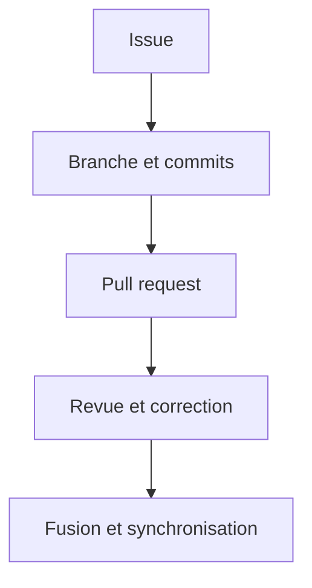

# Lab 4 — Collaboration professionnelle sur GitHub

## 1. Objectifs

À la fin de ce laboratoire, l'apprenant devra être capable de :

- transformer un besoin en issue GitHub précise ;
- créer une branche associée à cette issue ;
- organiser le travail en plusieurs commits courts et cohérents ;
- publier une branche avec `git push -u` et expliquer le rôle de `-u` ;
- ouvrir une pull request formelle et vérifiable ;
- effectuer une revue de code et demander une modification ;
- mettre à jour une pull request par de nouveaux commits ;
- comprendre qu'une pull request suit une branche, pas un commit unique ;
- actualiser une branche lorsque `main` reçoit de nouveaux commits ;
- comparer l'intégration de `origin/main` par merge et par rebase ;
- expliquer les risques liés à la réécriture d'une branche déjà publiée ;
- employer `--force-with-lease` uniquement dans un cas maîtrisé sur sa propre branche ;
- fusionner la pull request et récupérer proprement la nouvelle version de `main` ;
- appliquer une procédure complète de diagnostic et de collaboration.

Alice développe une fonctionnalité. Bob relit son code et contrôle sa conformité avant la fusion.

## 2. Prérequis

- Les Labs 1 à 3 ont été exécutés.
- Le dépôt GitHub `mini-projet-data` existe.
- Le remote `origin` est correctement configuré.
- La branche locale `main` suit `origin/main`.
- Le conflit du Lab 3 est résolu et aucun marqueur ne reste dans les fichiers.
- Le répertoire de travail et la zone de préparation sont propres.
- Alice dispose d'une copie principale dans `~/Documents/mini-projet-data`.
- Bob peut utiliser `~/Documents/mini-projet-data-bob` ou participer directement sur GitHub.

Dans la copie d'Alice, commencer par :

```bash
cd ~/Documents/mini-projet-data
pwd
git status
git branch --show-current
git remote -v
git fetch origin
git status
git log --oneline --graph --decorate --all -12
```

Avant de continuer, vérifier que :

- le chemin correspond à la copie d'Alice ;
- la branche active est `main` ;
- le répertoire est propre ;
- `origin` correspond au bon dépôt ;
- `main` et `origin/main` ne divergent pas.

Vérifier que la branche du scénario n'existe pas déjà :

```bash
git branch --list feature/calcul-moyenne
git ls-remote --heads origin feature/calcul-moyenne
```

La première commande recherche la branche locale. La seconde interroge en lecture seule les branches publiées sur `origin`. Une sortie vide est attendue. Si une branche existe, elle doit être inspectée avant toute réutilisation ou suppression.

## 3. Situation de départ

Au Lab 1, `analyse.py` calcule déjà une moyenne directement. L'objectif professionnel n'est pas de dupliquer ce calcul, mais de le transformer en fonction réutilisable et testable.

Le travail sera rattaché à une issue GitHub :

```text
Issue #1 — Créer une fonction réutilisable de calcul de la moyenne
```

La branche d'Alice sera :

```text
feature/calcul-moyenne
```

Le flux de travail sera le suivant :



Pendant la revue, une autre pull request fera avancer `main`. Alice devra inspecter cette évolution et mettre à jour sa branche avant la fusion finale.

## 4. Concepts

### 4.1 Issue GitHub

Une issue décrit un problème, une amélioration ou une tâche observable. Elle doit préciser le contexte, le résultat attendu et les critères permettant de décider si le travail est terminé.

Une bonne issue répond aux questions suivantes :

- quel problème doit être résolu ?
- pourquoi est-il important ?
- quel comportement est attendu ?
- comment vérifier la solution ?
- quels éléments sont hors périmètre ?

### 4.2 Branche de fonctionnalité

Une branche de fonctionnalité isole le travail lié à une issue. Le nom `feature/calcul-moyenne` communique le type de changement et son objectif. La branche doit partir d'une version récente de `main`.

### 4.3 Commits courts et cohérents

Plusieurs commits sont utiles lorsque chacun représente une étape logique :

```text
1. Ajoute la fonction calculer_moyenne
2. Ajoute un test du calcul de la moyenne
3. Évite l'exécution du script lors de l'import
```

Cette structure permet à Bob de relire les intentions séparément. Elle ne signifie pas qu'il faut créer un commit pour chaque ligne.

### 4.4 Pull request

Une pull request propose l'intégration d'une branche source dans une branche cible. Elle regroupe le diff, les commits, les tests, la discussion et les décisions de revue.

Une pull request reste attachée à la branche publiée. Lorsqu'Alice pousse un nouveau commit sur `feature/calcul-moyenne`, la pull request se met automatiquement à jour.

### 4.5 Revue de code

Bob peut :

- commenter une ligne ;
- poser une question ;
- approuver la proposition ;
- demander des modifications (*Request changes*).

Une demande de modification doit être précise, justifiée et vérifiable. Elle porte sur le code, non sur la personne. **:)**

### 4.6 Mettre à jour une branche depuis `origin/main`

Si `main` avance pendant le travail d'Alice, deux stratégies sont possibles.

| Stratégie | Commande depuis la branche de fonctionnalité | Historique | Réécrit les commits existants ? | Push suivant |
|---|---|---|---:|---|
| Merge | `git merge origin/main` | Conserve les deux lignées et ajoute éventuellement un commit de fusion | Non | `git push` ordinaire |
| Rebase | `git rebase origin/main` | Rejoue les commits de la fonctionnalité au-dessus de `origin/main` | Oui | Push ordinaire si la branche n'était pas publiée ; sinon mise à jour forcée maîtrisée |

Le merge est souvent préférable lorsqu'une branche publiée est utilisée par plusieurs personnes, car il ne remplace pas les commits existants. Le rebase offre un historique linéaire, mais réécrit l'identité des commits rejoués.

### 4.7 `--force-with-lease`

Après le rebase d'une branche déjà publiée, un push ordinaire est refusé parce que l'historique local ne prolonge plus directement l'historique distant. La commande suivante peut devenir nécessaire :

```bash
git push --force-with-lease origin feature/calcul-moyenne
```

`--force-with-lease` autorise le remplacement de l'historique distant seulement si la branche distante correspond encore à l'état que le clone croit connaître. Cette protection est meilleure que `--force`, mais elle ne rend pas l'opération anodine.

Elle n'est acceptable que si :

- la branche appartient à Alice ;
- aucun collaborateur ne construit son travail dessus ;
- Alice vient d'exécuter `git fetch origin` ;
- le graphe a été inspecté ;
- les tests réussissent ;
- l'équipe accepte la réécriture.

Elle ne doit jamais être lancée automatiquement et n'est pas utilisée sur une branche partagée comme `main`.

## 5. Commandes expliquées

### 5.1 `git switch -c feature/calcul-moyenne`

- **Problème résolu** : créer une branche depuis le commit courant et la sélectionner.
- **Dossier** : copie d'Alice, après vérification de `main`.
- **Option** : `-c` signifie *create*.
- **Effet** : crée un pointeur local ; aucun commit et aucune branche distante ne sont créés.
- **Vérification** : `git branch --show-current` et `git status`.
- **Erreur fréquente** : créer la branche depuis une version ancienne ou depuis une autre branche de fonctionnalité.

### 5.2 `git push -u origin feature/calcul-moyenne`

- **Problème résolu** : publier la nouvelle branche et établir son suivi distant.
- **Dossier** : copie d'Alice, sur `feature/calcul-moyenne`.
- **Option** : `-u`, forme courte de `--set-upstream`, associe la branche locale à `origin/feature/calcul-moyenne`.
- **Effet** : crée ou met à jour la branche sur GitHub. Les fichiers non commités ne sont pas envoyés.
- **Conséquence pratique** : les prochains envois de cette branche peuvent utiliser simplement `git push`.
- **Vérification** : `git branch -vv`, `git status` et page GitHub.
- **Erreur fréquente** : publier la mauvaise branche faute d'avoir vérifié la branche active.

### 5.3 `git fetch origin`

- **Problème résolu** : actualiser les références distantes locales avant d'évaluer la situation.
- **Effet** : met notamment à jour `origin/main` sans déplacer la branche active ni modifier les fichiers de travail.
- **Vérification** : `git log --oneline --graph --decorate --all`.
- **Erreur fréquente** : croire que le fetch intègre automatiquement les nouveaux commits dans la branche active.

### 5.4 `git merge origin/main`

- **Problème résolu** : intégrer l'état distant connu de `main` dans la branche active.
- **Dossier et branche** : copie d'Alice, sur `feature/calcul-moyenne`.
- **Argument** : `origin/main` est la référence distante locale actualisée par fetch.
- **Effet** : peut effectuer une avance rapide, créer un commit de fusion ou ouvrir un conflit. Les commits existants ne sont pas réécrits.
- **Vérification** : tests, `git status` et graphe de l'historique.
- **Erreur fréquente** : exécuter la commande depuis `main`, ce qui produit la direction d'intégration opposée à celle recherchée.

### 5.5 `git rebase origin/main`

- **Problème résolu** : replacer les commits propres à la branche active au-dessus du dernier `origin/main`.
- **Dossier et branche** : branche de fonctionnalité propre, jamais `main` dans ce scénario.
- **Effet** : recrée les commits concernés avec de nouveaux identifiants.
- **Vérification** : `git status`, graphe et tests.
- **Erreur fréquente** : rebaser puis forcer une branche partagée sans coordination.

### 5.6 `git pull --ff-only origin main`

- **Problème résolu** : actualiser la branche locale `main` après la fusion de la pull request.
- **Dossier et branche** : copie d'Alice, sur `main` avec un répertoire propre.
- **Option** : `--ff-only` autorise uniquement une avance rapide et refuse de créer automatiquement un commit de fusion.
- **Effet** : récupère puis avance `main` si elle ne contient aucun commit local divergent.
- **Vérification** : `git status` et graphe.
- **Erreur fréquente** : lancer la commande sur la branche de fonctionnalité ou avec des commits locaux divergents.

## 6. Manipulation guidée

### Étape A — Vérifier et actualiser `main`

Dans la copie d'Alice :

```bash
cd ~/Documents/mini-projet-data
pwd
git status
git branch --show-current
git remote -v
git fetch origin
git status
git log --oneline --graph --decorate --all -12
```

Ne continuez que si `main` est active, propre et synchronisée avec `origin/main`.

### Étape B — Créer l'issue GitHub

Sur GitHub, ouvrir l'onglet **Issues**, choisir **New issue** et utiliser le contenu suivant.

**Titre :**

```text
Créer une fonction réutilisable de calcul de la moyenne
```

**Description :**

```markdown
## Contexte

Le calcul de la moyenne est actuellement exécuté directement dans `analyse.py`.
Il ne peut pas être importé et testé isolément.

## Travail demandé

Créer une fonction `calculer_moyenne(valeurs)` et l'utiliser dans le script.

## Critères d'acceptation

- la fonction retourne la moyenne d'une liste numérique ;
- un test simple valide le résultat pour `[10, 20, 30]` ;
- importer `analyse` ne déclenche aucun affichage ;
- l'exécution normale de `analyse.py` continue de fonctionner.

## Hors périmètre

La gestion statistique des valeurs manquantes n'est pas traitée dans cette issue.
```

Créer l'issue et noter son numéro. Les exemples supposent `#1`; remplacer ce numéro s'il diffère.

### Étape C — Créer la branche liée à l'issue

De retour dans Git Bash, confirmer la base :

```bash
pwd
git status
git branch --show-current
```

Créer la branche :

```bash
git switch -c feature/calcul-moyenne
```

Vérifier :

```bash
git branch --show-current
git status
```

### Étape D — Premier commit : créer la fonction

Dans `analyse.py`, définir avant le code d'exécution :

```python
def calculer_moyenne(valeurs):
    """Retourne la moyenne arithmétique d'une liste non vide."""
    if not valeurs:
        raise ValueError("La liste ne doit pas être vide.")
    return sum(valeurs) / len(valeurs)
```

Remplacer ensuite le calcul direct de la moyenne par :

```python
moyenne = calculer_moyenne(valeurs)
```

Examiner précisément le changement :

```bash
git status
git diff -- analyse.py
```

Préparer et relire :

```bash
git add analyse.py
git diff --staged
```

Créer le premier commit :

```bash
git commit -m "Ajoute la fonction calculer_moyenne"
```

Vérifier :

```bash
git status
git log --oneline -3
```

### Étape E — Deuxième commit : ajouter un test

Créer `test_analyse.py` :

```python
from analyse import calculer_moyenne


resultat = calculer_moyenne([10, 20, 30])
assert resultat == 20

print("Test du calcul de la moyenne réussi.")
```

Exécuter le test :

```bash
python test_analyse.py
```

À ce stade, le test peut réussir tout en affichant aussi les résultats d'`analyse.py`. Bob demandera de supprimer cet effet secondaire pendant la revue.

Examiner et enregistrer le test séparément :

```bash
git status
git diff -- test_analyse.py
git add test_analyse.py
git diff --staged
git commit -m "Ajoute un test du calcul de la moyenne"
```

Vérifier l'historique :

```bash
git status
git log --oneline -4
```

### Étape F — Publier la branche

Avant le premier push :

```bash
pwd
git status
git branch --show-current
git remote -v
git log --oneline -4
```

Publier et configurer le suivi :

```bash
git push -u origin feature/calcul-moyenne
```

Vérifier :

```bash
git status
git branch -vv
```

La branche locale doit suivre `origin/feature/calcul-moyenne`. Aucun fichier non commité n'a été envoyé.

### Étape G — Ouvrir une pull request formelle

Sur GitHub, créer une pull request avec :

- branche cible (*base*) : `main` ;
- branche source (*compare*) : `feature/calcul-moyenne`.

**Titre :**

```text
Ajoute une fonction réutilisable de calcul de la moyenne
```

**Description formelle :**

````markdown
## Problème

Le calcul de la moyenne est intégré directement au script et ne peut pas être testé isolément.

## Solution

- ajout de `calculer_moyenne(valeurs)` ;
- utilisation de la fonction dans `analyse.py` ;
- ajout d'un test minimal dans `test_analyse.py`.

## Méthode de test

```bash
python test_analyse.py
python analyse.py
```

## Issue associée

Closes #1

## Liste de vérification

- [x] Le changement répond aux critères d'acceptation.
- [x] Les commits sont courts et cohérents.
- [x] Aucun secret ni fichier local n'est ajouté.
- [x] Le test automatisé réussit.
- [ ] L'import du module ne déclenche aucun affichage.
````

`Closes #1` fermera automatiquement l'issue lorsque la pull request sera fusionnée, si `#1` correspond au numéro réel.

### Étape H — Bob demande une modification

Bob ouvre l'onglet **Files changed**, constate que :

```python
from analyse import calculer_moyenne
```

exécute aussi les affichages placés au niveau principal d'`analyse.py`. Il choisit **Review changes**, puis **Request changes** avec le commentaire :

```text
Le test importe `analyse`, mais cet import déclenche actuellement les affichages du script.
Merci de placer le code d'exécution sous `if __name__ == "__main__":`, puis de relancer les deux commandes de test.
```

Cette demande est précise : elle décrit le problème, la correction attendue et la vérification.

Pour une véritable revue, Bob doit utiliser un compte collaborateur distinct. GitHub peut empêcher l'auteur d'approuver sa propre pull request. Si un seul compte est disponible pendant l'apprentissage, reproduire la discussion au moyen de commentaires, tout en distinguant clairement les deux rôles.

### Étape I — Alice corrige la branche

Dans la copie d'Alice, vérifier :

```bash
pwd
git status
git branch --show-current
```

La branche doit être `feature/calcul-moyenne` et le répertoire propre.

Dans `analyse.py`, conserver la fonction au niveau du module, puis placer l'exécution sous :

```python
if __name__ == "__main__":
    valeurs = [12, 15, 18]
    print(valeurs)

    moyenne = calculer_moyenne(valeurs)
    print(f"Moyenne : {moyenne}")

    minimum = min(valeurs)
    maximum = max(valeurs)
    print(f"Minimum : {minimum}")
    print(f"Maximum : {maximum}")

    etendue = maximum - minimum
    print(f"Étendue : {etendue}")
```

Adapter ce bloc si le fichier contient d'autres calculs légitimes issus des exercices précédents.

Exécuter les vérifications :

```bash
python test_analyse.py
python analyse.py
git diff -- analyse.py
```

Préparer et committer la correction :

```bash
git add analyse.py
git diff --staged
git commit -m "Évite l'exécution du script lors de l'import"
```

Vérifier puis mettre à jour la pull request :

```bash
git status
git log --oneline -5
git push
```

L'option `-u` n'est plus nécessaire, car le suivi a été configuré lors du premier push. La pull request doit afficher automatiquement le nouveau commit.

Sur GitHub, Alice répond au commentaire de Bob, indique les commandes de test exécutées et coche le dernier élément de la liste de vérification.

### Étape J — `main` reçoit un nouveau commit

Pendant que la pull request d'Alice reste ouverte, Bob fait fusionner une autre petite pull request ajoutant à `README.md` :

```markdown
## Compatibilité

Le projet utilise Python 3.
```

Pour simuler ce travail proprement, Bob utilise sa copie :

```bash
cd ~/Documents/mini-projet-data-bob
pwd
git status
git switch main
git pull --ff-only origin main
git status
git switch -c docs/compatibilite-python
```

Après avoir modifié `README.md`, Bob examine et enregistre uniquement la documentation :

```bash
git diff -- README.md
git add README.md
git diff --staged
git commit -m "Documente la compatibilité avec Python 3"
git push -u origin docs/compatibilite-python
```

Bob ouvre ensuite une pull request séparée, la fait relire et la fusionne dans `main`. Cette procédure simule un autre travail d'équipe sans pousser directement sur la branche principale.

Une fois cette pull request fusionnée, Alice inspecte la situation :

```bash
cd ~/Documents/mini-projet-data
pwd
git status
git branch --show-current
git fetch origin
git log --oneline --graph --decorate --all -15
```

`origin/main` doit maintenant posséder un commit absent de `feature/calcul-moyenne`. Le fetch n'a pas encore intégré ce commit dans la branche d'Alice.

### Étape K — Comparer les stratégies et choisir le merge

Avant toute intégration :

```bash
git status
git branch --show-current
```

La branche doit être `feature/calcul-moyenne` et le répertoire propre.

Dans ce scénario, la branche est déjà publiée et peut être consultée par Bob. Alice choisit donc la stratégie qui ne réécrit pas les commits existants :

```bash
git merge origin/main
```

Si un éditeur s'ouvre, conserver le message de fusion proposé, enregistrer et fermer l'éditeur.

Exécuter les tests et inspecter l'historique :

```bash
python test_analyse.py
python analyse.py
git status
git log --oneline --graph --decorate --all -15
```

Publier le commit de fusion sur la branche de la pull request :

```bash
git push
```

La pull request contient maintenant la fonctionnalité d'Alice et le dernier état de `main`.

### Étape L — Comprendre l'alternative rebase sans l'exécuter mécaniquement

Si Alice était seule sur sa branche et si l'équipe exigeait un historique linéaire, la séquence possible serait :

```bash
git status
git branch --show-current
git fetch origin
git log --oneline --graph --decorate --all -15
git rebase origin/main
python test_analyse.py
git log --oneline --graph --decorate --all -15
```

Si la branche n'avait jamais été publiée, un `git push -u origin feature/calcul-moyenne` ordinaire suffirait ensuite.

Si la branche avait déjà été publiée, le rebase aurait remplacé ses commits. Après coordination et vérification, seule la branche personnelle pourrait être mise à jour avec :

```bash
git push --force-with-lease origin feature/calcul-moyenne
```

Cette commande est présentée pour compréhension. Elle ne doit pas être exécutée après la stratégie merge choisie à l'étape K, ni sur `main`, ni sur une branche partagée.

### Étape M — Approbation et fusion finale

Bob relit les nouveaux commits et vérifie :

- le test réussit ;
- l'import ne déclenche plus les affichages ;
- la branche contient le dernier `main` ;
- les commentaires de revue sont traités ;
- la checklist de la pull request est complète.

Bob choisit **Approve**. La pull request peut ensuite être fusionnée dans `main`. Pour ce laboratoire, utiliser **Create a merge commit** afin de conserver les commits pédagogiques et la structure de collaboration.

Vérifier sur GitHub que :

- la pull request est marquée **Merged** ;
- l'issue associée est fermée ;
- la branche `main` contient la fonction et le test.

### Étape N — Récupérer la nouvelle version de `main`

Dans la copie d'Alice :

```bash
cd ~/Documents/mini-projet-data
pwd
git status
git branch --show-current
```

Le répertoire doit être propre avant le changement de branche.

Revenir sur `main` :

```bash
git switch main
git status
```

Récupérer uniquement par avance rapide :

```bash
git pull --ff-only origin main
```

Vérifier :

```bash
git status
git branch -vv
git log --oneline --graph --decorate --all -18
python test_analyse.py
```

Vérifier la fusion avant de supprimer la branche locale :

```bash
git branch --merged main
git branch -d feature/calcul-moyenne
git branch
```

La suppression de la branche distante peut être effectuée avec le bouton GitHub proposé après la fusion. Ne supprimez jamais une branche non fusionnée sans inspection.

## 7. Résultat attendu

À la fin du scénario :

- l'issue décrit un besoin et des critères d'acceptation ;
- Alice a développé sur `feature/calcul-moyenne` ;
- la branche contient plusieurs commits logiques ;
- la pull request possède une description, une méthode de test et une référence à l'issue ;
- Bob a demandé une correction précise ;
- Alice a corrigé le code et mis à jour la pull request par un push normal ;
- `main` a avancé pendant le développement ;
- Alice a intégré `origin/main` par merge sans réécrire la branche publiée ;
- Bob a approuvé la version finale ;
- la pull request est fusionnée et l'issue fermée ;
- la branche locale `main` d'Alice correspond à `origin/main` ;
- les tests réussissent et le répertoire est propre.

## 8. Méthode de vérification

Dans la copie d'Alice, exécuter :

```bash
pwd
git status
git branch --show-current
git branch -vv
git remote -v
git log --oneline --graph --decorate --all -18
```

Résultat attendu :

- chemin correct ;
- branche active `main` ;
- `working tree clean` ;
- `main` à jour avec `origin/main` ;
- historique montrant la pull request fusionnée.

Vérifier les fichiers :

```bash
python test_analyse.py
python analyse.py
git diff
git diff --staged
```

Le test et le programme doivent réussir. Les deux diffs doivent être vides.

Sur GitHub, vérifier :

- issue fermée ;
- pull request fusionnée ;
- conversation de revue conservée ;
- test et fonction visibles sur `main` ;
- aucun secret ni fichier local ajouté.

## 9. Erreurs fréquentes

| Symptôme | Cause probable | Inspection sûre | Action conseillée |
|---|---|---|---|
| Branche créée depuis une mauvaise base | `main` n'était pas active ou actualisée | `git branch --show-current` et graphe | Revenir à une base correcte avant de commencer du nouveau travail |
| `src refspec ... does not match any` | Nom de branche incorrect ou absence de commit | `git branch` et `git log --oneline` | Corriger le nom ou créer le commit prévu |
| La pull request compare les mauvaises branches | Base et compare inversées | Bandeau de la pull request | Choisir `main` comme cible et la branche feature comme source |
| Le nouveau commit n'apparaît pas dans la PR | Push effectué sur une autre branche | `git branch --show-current`, `git branch -vv` | Pousser la branche réellement associée à la PR |
| Tests différents entre Alice et Bob | Environnement ou commande non documentés | Relire la section Méthode de test | Documenter une commande reproductible et les prérequis |
| `main` a avancé pendant la PR | Une autre contribution a été fusionnée | `git fetch origin`, puis graphe | Choisir consciemment merge ou rebase |
| Push refusé après rebase | Les identifiants de commits ont changé | Graphe local et distant | Vérifier la propriété de la branche avant toute mise à jour forcée |
| `--force-with-lease` est refusé | La branche distante a changé depuis le dernier état connu | `git fetch origin`, puis graphe | Ne pas contourner le refus ; coordonner et préserver le travail distant |
| Conflit pendant merge ou rebase | Modifications incompatibles | `git status` et fichiers marqués | Résoudre chaque fichier, tester, puis terminer l'opération appropriée |
| `pull --ff-only` est refusé sur `main` | `main` locale possède des commits divergents | `git fetch origin` et graphe | Diagnostiquer l'origine des commits ; ne pas forcer |

### Diagnostic formel d'un push refusé

Ne pas répéter le push et ne pas forcer. Exécuter :

```bash
pwd
git status
git branch --show-current
git remote -v
git fetch origin
git log --oneline --graph --decorate --all -20
```

Déterminer ensuite :

1. quelle branche locale contient le travail ;
2. quelle branche distante a avancé ;
3. si le répertoire est propre ;
4. si les commits sont seulement locaux, seulement distants ou divergents ;
5. si la politique du projet demande merge ou rebase ;
6. quels tests doivent réussir avant un nouveau push.

En cas d'erreur, transmettre le message complet et toutes ces sorties. Ne jamais communiquer un jeton, mot de passe ou secret.

## 10. Exercice

Réaliser un cycle de collaboration complet pour une nouvelle fonctionnalité : le calcul de la médiane.

### Travail demandé

1. Créer une issue intitulée `Ajouter le calcul de la médiane` avec contexte, critères d'acceptation et méthode de test.
2. Actualiser `main`, puis créer `feature/calcul-mediane` depuis celle-ci.
3. Ajouter une fonction `calculer_mediane(valeurs)` dans `analyse.py`.
4. Créer un premier commit logique pour la fonction.
5. Ajouter au moins deux tests dans `test_analyse.py` : liste de longueur impaire et liste de longueur paire.
6. Créer un deuxième commit logique pour les tests.
7. Pousser la branche avec `-u` et expliquer son effet.
8. Ouvrir une pull request comprenant problème, solution, tests, référence à l'issue et checklist.
9. Demander à Bob de formuler une demande de modification vérifiable, puis créer un commit de correction.
10. Faire avancer `main` avec une autre petite pull request de documentation.
11. Exécuter `git fetch origin` et interpréter le graphe.
12. Choisir merge ou rebase pour actualiser la branche de médiane et justifier ce choix.
13. Relancer les tests, mettre à jour la pull request et obtenir l'approbation de Bob.
14. Fusionner la pull request.
15. Actualiser la branche locale `main` avec une avance rapide uniquement.
16. Vérifier la fusion avant de supprimer la branche locale de fonctionnalité.

### Livrables à transmettre

- le numéro et le contenu de l'issue ;
- la description de la pull request ;
- le commentaire de revue de Bob ;
- la justification du choix entre merge et rebase ;
- les sorties de test ;
- les sorties finales suivantes :

```bash
pwd
git status
git branch --show-current
git branch -vv
git remote -v
git log --oneline --graph --decorate --all -20
```

## 11. Questions de compréhension

1. Quelle différence existe-t-il entre une issue et une pull request ?
2. Pourquoi une branche de fonctionnalité doit-elle partir d'une version récente de `main` ?
3. Que fait exactement `-u` dans le premier push d'une branche ?
4. Pourquoi une pull request se met-elle à jour après un nouveau push ?
5. Quelles informations une bonne description de pull request doit-elle contenir ?
6. Pourquoi la demande de modification de Bob est-elle vérifiable ?
7. Pourquoi le merge est-il choisi dans le scénario guidé ?
8. Quel avantage et quel coût présente le rebase ?
9. Pourquoi un rebase change-t-il les identifiants des commits ?
10. Quelle protection supplémentaire apporte `--force-with-lease` par rapport à `--force` ?
11. Pourquoi cette protection ne justifie-t-elle pas son utilisation sur `main` ?
12. Quel rôle joue `--ff-only` lors de la récupération finale de `main` ?

## 12. Résumé

### Fiche récapitulative des commandes

| Commande | Rôle principal | Modifie l'historique ou les fichiers ? |
|---|---|---|
| `git status` | Examiner la branche, l'index et le répertoire de travail | Non |
| `git diff` | Lire les modifications non préparées | Non |
| `git diff --staged` | Lire le prochain contenu à committer | Non |
| `git add <fichier>` | Préparer un contenu précis | Modifie l'index |
| `git commit -m "..."` | Créer un commit local | Ajoute à l'historique |
| `git log --oneline --graph --decorate --all` | Visualiser les références et l'historique | Non |
| `git remote -v` | Inspecter les dépôts distants | Non |
| `git fetch origin` | Actualiser les références distantes locales | Pas la branche active ni les fichiers de travail |
| `git pull --rebase origin main` | Récupérer puis rejouer les commits locaux | Oui, réécrit les commits rejoués |
| `git switch <branche>` | Changer de branche | Met à jour les fichiers de travail |
| `git switch -c <branche>` | Créer et sélectionner une branche | Crée un pointeur et met à jour `HEAD` |
| `git merge <branche>` | Intégrer une branche dans la branche active | Peut déplacer une branche ou créer un commit |
| `git branch -d <branche>` | Supprimer prudemment une branche locale fusionnée | Supprime le pointeur local |
| `git push -u origin <branche>` | Publier et configurer le suivi | Met à jour la branche distante |
| `git pull --ff-only origin main` | Actualiser `main` sans fusion implicite | Avance `main` si possible |

### Comparaison de `fetch`, `pull`, `merge` et `rebase`

| Opération | Réseau | Source habituelle | Intègre dans la branche active | Réécrit des commits existants |
|---|---:|---|---:|---:|
| `fetch` | Oui | Dépôt distant | Non | Non |
| `pull` | Oui | Dépôt distant | Oui, après fetch | Selon stratégie |
| `merge` | Non après fetch | Branche ou référence locale | Oui | Non |
| `rebase` | Non après fetch | Branche ou référence locale | Oui | Oui pour les commits rejoués |

### Procédure de résolution d'un conflit

```text
1. Lire git status.
2. Ouvrir chaque fichier en conflit.
3. Comprendre les versions HEAD et entrante.
4. Décider du contenu final avec les collaborateurs.
5. Retirer tous les marqueurs.
6. Exécuter les tests pertinents.
7. Préparer chaque fichier résolu avec git add.
8. Examiner git status et git diff --staged.
9. Terminer par git commit pour un merge ou git rebase --continue pour un rebase.
10. Vérifier le graphe et les tests avant le push.
```

### Bonnes pratiques de collaboration

- actualiser et vérifier `main` avant de créer une branche ;
- associer chaque changement significatif à une issue ;
- utiliser une branche courte et clairement nommée ;
- créer des commits logiques avec des messages précis ;
- relire le diff préparé avant chaque commit ;
- pousser régulièrement sa branche sans pousser de travail incomplet sur `main` ;
- documenter le problème, la solution et les tests dans la pull request ;
- traiter les commentaires de revue par de nouveaux commits traçables ;
- exécuter les tests après une intégration de `main` ;
- protéger les secrets, données sensibles, caches, environnements et réglages locaux ;
- éviter les modifications concurrentes d'un même notebook Jupyter ;
- limiter les sorties volumineuses des notebooks et relire le diff avant publication ;
- préférer un format textuel ou un outil de diff adapté lorsque les notebooks deviennent difficiles à réviser ;
- ne jamais forcer automatiquement `main` ;
- supprimer une branche seulement après vérification de sa fusion.

### Grille d'acquisition des compétences

| Compétence | Preuve attendue | Acquis |
|---|---|:---:|
| Initialiser et inspecter un dépôt | `git status` et historique corrects | [ ] |
| Préparer un commit précis | Diff préparé limité au changement logique | [ ] |
| Utiliser `.gitignore` | Fichiers locaux exclus avant ajout | [ ] |
| Relier un dépôt à GitHub | `origin` correct et branche suivie | [ ] |
| Diagnostiquer un push refusé | Fetch et graphe interprétés correctement | [ ] |
| Distinguer fetch et pull | Effets expliqués sans ambiguïté | [ ] |
| Créer et fusionner des branches | Direction du merge correctement choisie | [ ] |
| Résoudre un conflit | Marqueurs retirés et résolution testée | [ ] |
| Supprimer prudemment une branche | Vérification par `git branch --merged` | [ ] |
| Créer une issue exploitable | Critères d'acceptation vérifiables | [ ] |
| Rédiger une pull request formelle | Problème, solution, tests, issue et checklist | [ ] |
| Effectuer une revue de code | Commentaire précis et actionnable | [ ] |
| Comparer merge et rebase | Choix justifié selon la branche et l'équipe | [ ] |
| Synchroniser `main` après une PR | Avance rapide et état propre | [ ] |
| Protéger l'historique partagé | Aucun push forcé automatique sur `main` | [ ] |

Le cycle professionnel complet est désormais :

```text
issue → branche → petits commits → push → pull request → revue
→ correction → synchronisation → tests → approbation → fusion
→ mise à jour de main → suppression prudente de la branche
```
